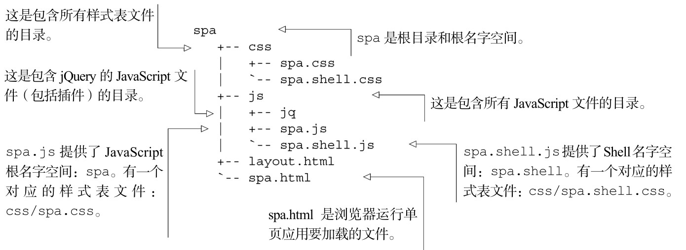
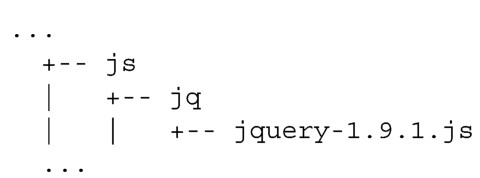
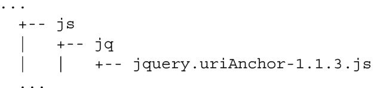

#### 
  3.2.1 创建文件结构

我们已经选择spa作为单页应用的根名字空间。JavaScript和CSS文件名、JavaScript名字空间和CSS选择器名称都同步使用。这样就很容易追踪哪个JavaScript文件搭配哪个CSS文件。

1．规划目录和文件

Web开发人员经常把HTML文件放在一个目录中，把CSS和JavaScript文件放在子目录中。我们没有理由打破这个惯例。我们来创建目录和文件，如代码清单3-1所示。

代码清单3-1 第一轮，文件和目录

现在已经有了基础结构，我们来安装jQuery。

2．安装jQuery和插件

jQuery和它的插件经常以压缩文件或者普通文件的形式提供。我们几乎总是安装普通文件，因为这有益于调试，然而无论怎样，我们都会对它进行压缩，作为构建系统的一部分。现在不用担心它们是做什么用的，稍后在本章你会明白的。

jQuery库提供了跨平台DOM操作和其他工具方法。我们使用的版本是1.9.1，可以从http://docs.jquery.com/Downloading_jQuery获取。我们把它放在jQuery目录中：

jQuery的uriAnchor插件提供了管理URI的锚组件的工具方法。该插件可以从github上获取：https://github.com/mmikowski/urianchor。我们把它放在同一个jQuery目录中：

现在文件和目录结构看起来应该和代码清单3-2一样：

代码清单3-2 添加了jQuery和插件之后的文件和目录结构

现在已经有了所有的文件，是时候开始编写一些HTML、CSS和JavaScript了。

