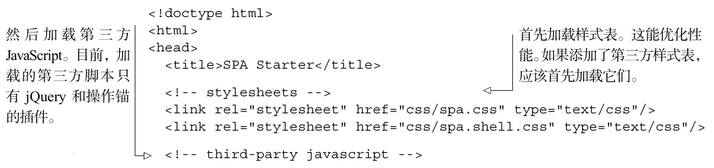

#### 
  3.2.2 编写应用的HTML文件

当打开浏览文档（spa/spa.html）时，我们能感觉到到目前为止已经开发的单页应用的所有优点。当然，因为这是一个空文件，它的优点仅仅是没有bug、高度安全的空白页面，什么都没有做。我们来改变“空白页面”部分。

浏览文档（spa/spa.html）总是保持很小的体积。它唯一的角色是加载库和样式表，然后启动应用。我们打开最喜爱的文本编辑器，添加本章需要用到的所有代码，如代码清单 3-3所示。

代码清单3-3 应用的HTML文件——spa/spa.html

有性能意识的开发朋友可能会问“为什么不和传统网页一样，把脚本文件放到 body容器的最后面呢？”这是一个值得探讨的问题，因为这么做的话，静态的HTML和CSS在JavaScript加载完成前就能显示，通常会使页面渲染更快。然而，单页应用不是这样工作的。它们使用JavaScript来生成HTML，因此将脚本放置在头部之外，并不能更快地渲染页面。相反，我们把所有的外部脚本放在head区块中，以便改进组织结构和易读性。

