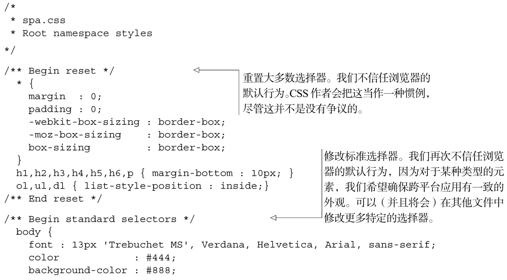
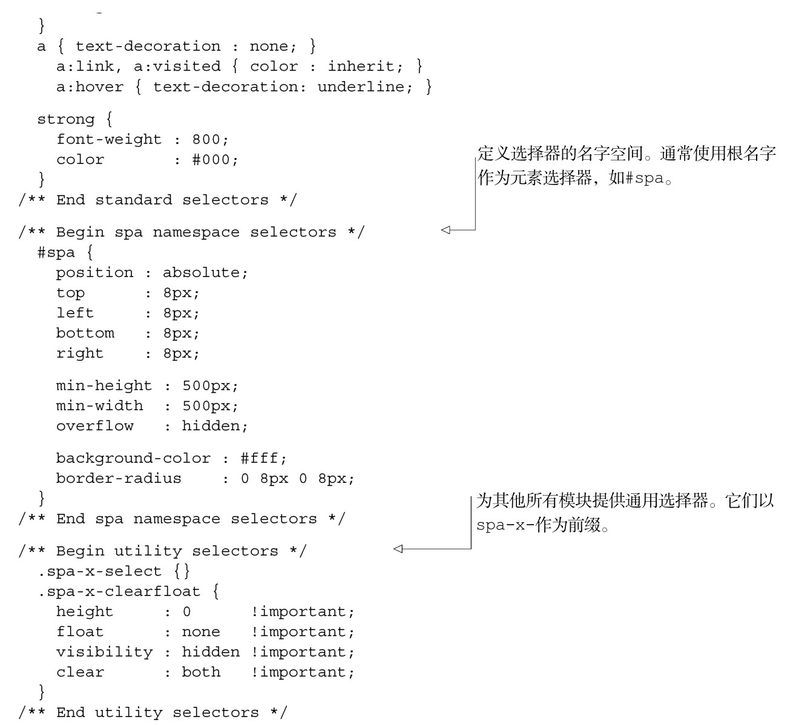

#### 
  3.2.3 创建CSS根名字空间

我们的根名字空间是spa，按照附录A的约定，根样式表应该叫做spa/css/spa.css。之前我们已经创建了这个文件，现在来填写内容。因为这是根样式表，它会比其他CSS文件多一些内容。再次打开喜爱的文本编辑器，添加所需的CSS规则，如代码清单3-4所示。

代码清单3-4 CSS 根名字空间——spa/css/spa.css

按照我们的编码标准，文件中所有的CSS id 和class都以spa-为前缀。现在已经创建了应用的根CSS文件，我们将创建对应的JavaScript名字空间。

