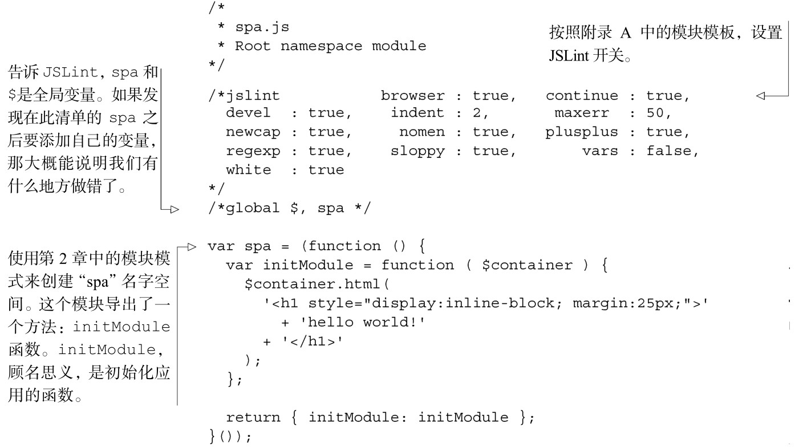
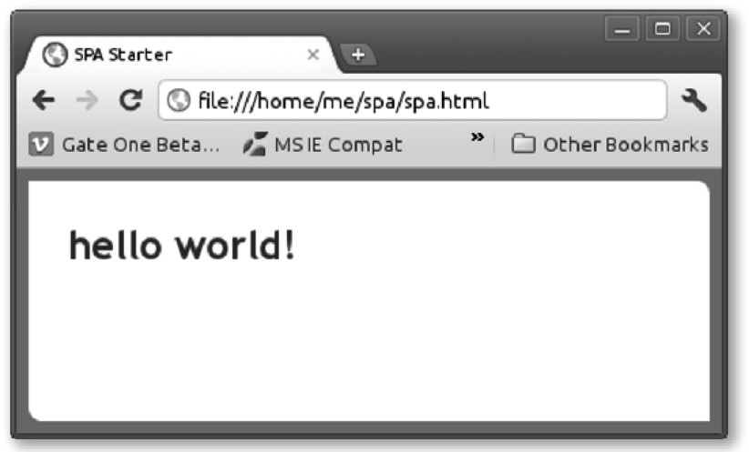

#### 
  3.2.4 创建JavaScript根名字空间

我们的根名字空间是spa，按照附录A的约定，根JavaScript应该叫做spa/js/spa.js。必需的JavaScript至少是var spa={};。但是，我们希望添加一个初始化应用的方法，希望确保代码通过JSLint的验证。可以使用附录A中的模板，删去一些东西，因为我们不需要所有的内容。我们用第二喜爱的文本编辑器打开这个文件，填写代码清单3-5所示的内容。

代码清单3-5 JavaScript 的根名字空间——spa/js/spa.js

我们希望确保代码没有任何常见的错误和不好的写法。附录A演示了如何安装和运行JSLint这个充满价值的工具，它正好就是做这件事情的。附录A描述了文件顶部的所有/*jslint...*/开关的意思。除了附录A，我们还会在第5章更深入地讨论JSLint。

在命令行中输入 jslint spa/js/spa.js 来检查一下我们的代码，我们不应该看到任何警告和错误。现在可以打开浏览文档（spa/spa.html），可以看到有着统治地位的“hello world”，如图3-2 所示。

现在已经问候过了世界，并受到了美味的成功味道的鼓舞，我们开始更有挑战的探索吧。在下一小节，我们开始构建第一个实际工作中的单页应用。

