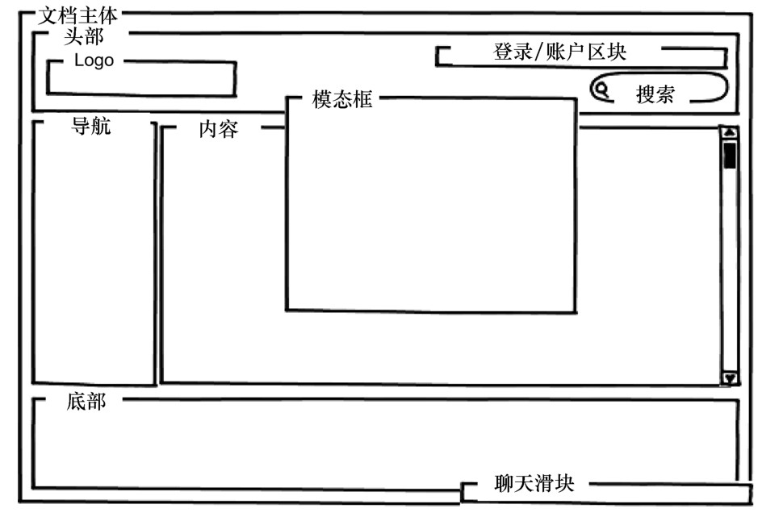

### 
  3.3 创建功能容器

Shell 创建并管理着功能模块要用到的容器。比如，聊天滑块容器，会按照流行的惯例，固定在浏览器窗口的右下角。Shell负责管理滑块容器，但不会管理容器内部的行为，这是留给聊天功能模块的，我们将在第6章讨论这个模块。

我们把聊天滑块放在比较完整的布局中。图3-3演示了我们想看到的容器线框图。

当然，这只是一张线框图。我们需要把它转换为HTML和CSS。我们讨论一下如何来做。

