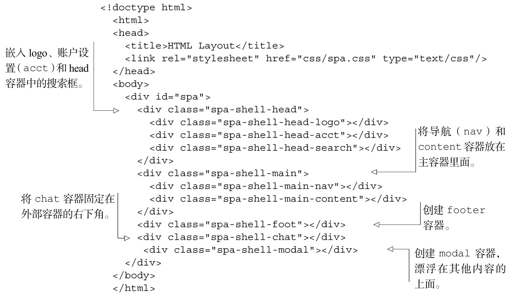

#### 
  3.3.2 编写Shell的HTML

HTML5和CSS3的一个主要功能是，我们真的能够把样式和内容分隔开来。线框图显示了我们想要的容器以及它们是如何嵌套的。这是满怀信心地编写容器的 HTML 所需的。打开布局文档（spa/layout.html），输入代码清单3-6所示的HTML。

代码清单3-6 创建容器的HTML——spa/layout.html

现在应该验证一下HTML，确保它没有错误。我们喜欢使用令人尊敬的Tidy 工具，它可以找出缺少的标签和其他常见的HTML错误。你可以在http://infohound.net/tidy/找到Tidy的在线版，或者在http://tidy.sourceforge.net/下载它的源代码。如果你使用的是Linux发行版，像Ubuntu或者Fedora，在标准软件库中很可能有现成的Tidy。现在我们来给这些容器添加一些样式。

