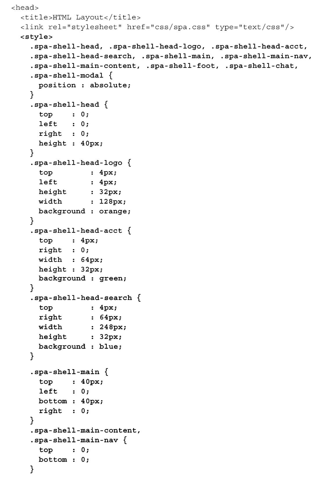
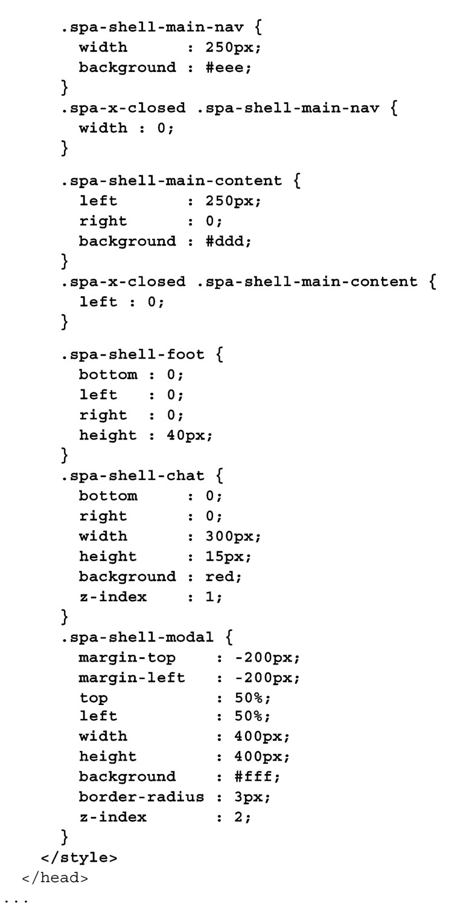
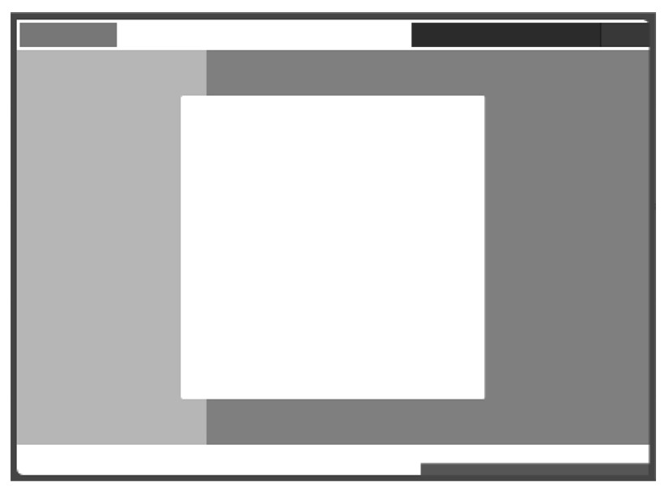
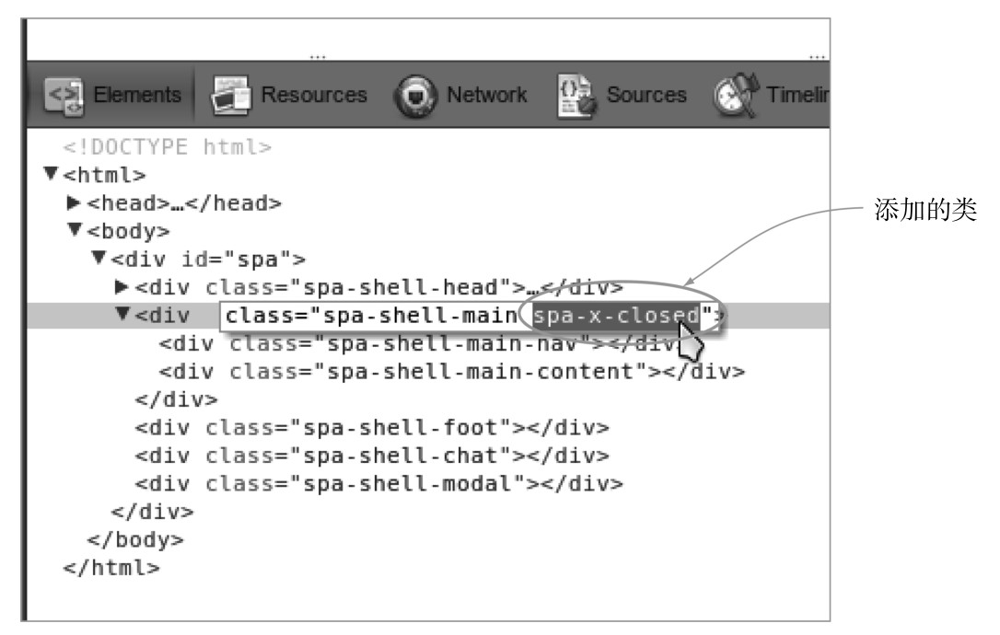

#### 
  3.3.3 编写Shell的CSS

我们将编写支持流式布局（liquid layout）的CSS，除了一些最极端的尺寸，内容的宽度和高度会完全自适应填充浏览器窗口。我们会给功能容器添加背景颜色，这样就可以很容易地看见它们。我们会避免使用任何边框，因为它们会更改 CSS 盒子的尺寸。这在快速原型开发过程中会引入不必要的麻烦。一旦对容器的展示满意了，必要时可以再回过头来添加边框。

流式布局

随着布局变得越来越复杂，我们可能需要使用JavaScript来支持布局的流动性（liquidity）。经常使用窗口尺寸变化的事件处理程序来确定浏览器窗口的尺寸，然后重新计算并应用新的CSS尺寸。我们会在第4章演示这个技术。

我们在布局文档（spa/layout.html）的<head>区块中添加CSS。可以把它放在spa.css样式表的后面，如代码清单3-7所示。所有的更改以粗体显示。

代码清单3-7 创建容器的CSS——spa/layout.html

当打开浏览文档（spa/layout.html）时，我们应该看到一张和线框图非常相似的页面，如图3-4所示。当改变浏览器窗口的尺寸时，我们看到功能容器也会根据需要改变尺寸。我们的流式布局有局限性，如果将宽度或高度缩至小于500像素，就会出现滚动条。这么做是因为我们不能把内容压缩至该尺寸之下。

可以使用Chrome开发者工具，测试一下某些新定义的样式，初始显示的页面没有使用它们。比如，在 spa-shell-main 容器上添加类 spa-x-closed。这会关闭页面左边的导航条。移除这个类会还原导航条，如图3-5所示。

