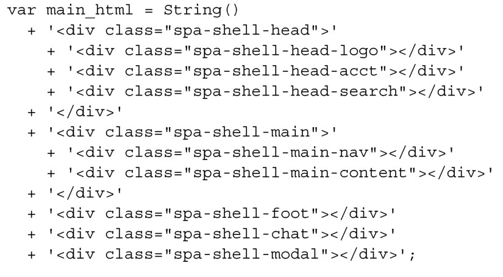
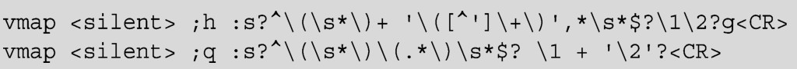

#### 
  3.4.1 将HTML转换为JavaScript

我们需要 JavaScript 来管理所有的文档变化，因此需要把前面开发的 HTML 转换为JavaScript字符串。我们会保留HTML的缩进，使之容易阅读和维护，如代码清单3-8所示。

代码清单3-8 拼接HTML模板

我们不担心拼接字符串导致的任何性能损失。当发布产品时，JavaScript 压缩工具会替我们把字符串拼接在一起。

配置你的编辑器！

一名专业的开发人员，应该使用专业级别的文本编辑器或者IDE。它们大多数都支持正则表达式和宏（macro）。我们应该使得HTML转换为JavaScript字符串这一过程自动化。例如，令人尊敬的vim编辑器就能配置成只需两个按键，就能将HTML格式化为用JavaScript拼接的字符串。可以将下面的内容添加到～/.vimrc文件中：

当启动vim时，可以直观地选择要改变的HTML。当按下;q，选择的内容会被格式化；当按下;h，会取消格式化。

