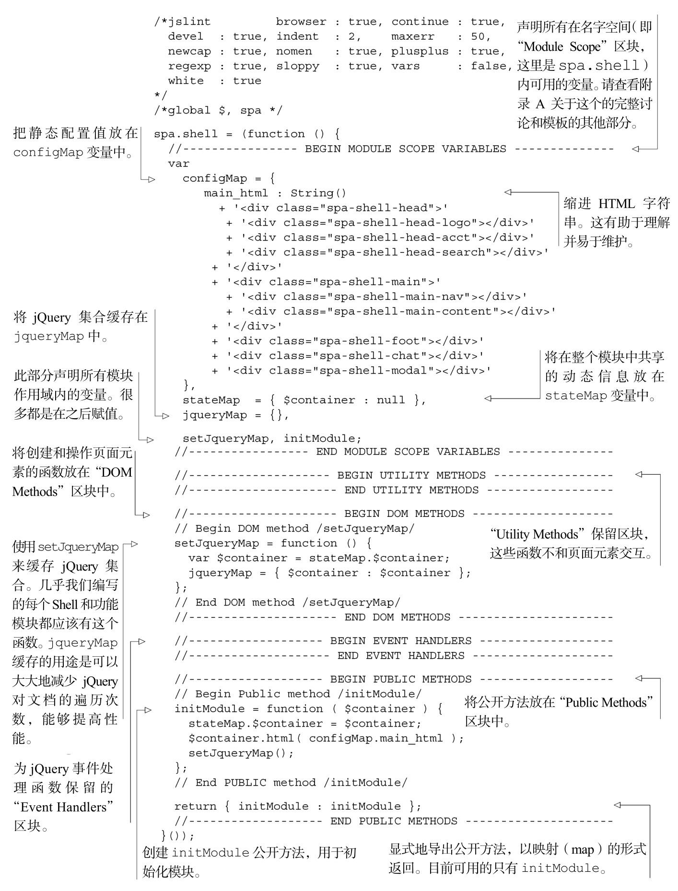

#### 
  3.4.2 在JavaScript中添加HTML模板

现在是时候往前走一大步并创建Shell。当初始化Shell时，想让它根据我们的选择，用功能模块来填充页面元素。在这么做的时候，我们想缓存 jQuery 集合对象。可以使用附录A中的模块模板，连同刚才创建好的JavaScript字符串，来完成这个功能。打开文本编辑器，创建如代码清单3-9所示的文件。请小心留意注释，它们提供了有用的细节。

代码清单3-9 开始编写Shell——spa/js/spa.shell.js

现在有了渲染功能容器的模块，但仍然需要填写 CSS 文件，指示根名字空间模块（spa/js/spa.js）来使用 Shell 模块（spa/js/spa.shell.js），而不是显示有着鼎鼎大名的“hello world”。我们就这么来做。

