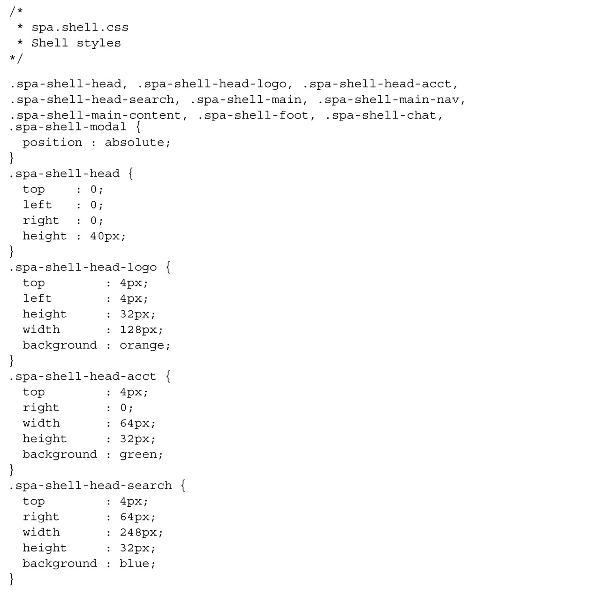
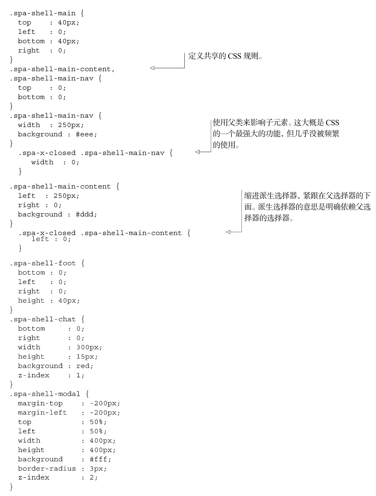

#### 
  3.4.3 编写Shell的样式表

使用附录A中展示的便利的名字空间约定，我们知道需要在名为spa/css/spa.shell.css的文件中使用spa-shell-*选择器。可以把在spa/layout.html中已经开发好的CSS直接复制到这个文件中，如代码清单3-10所示。

代码清单3-10 Shell 的CSS，直接拿来用的——spa/css/spa.shell.css

所有选择器的前缀都是spa-shell-。这有很多好处。

这表明这些类是由Shell模块（spa/js/spa.shell.js）控制的。

这能防止和第三方脚本以及我们的其他模块产生名字空间的冲突。

在调试和查看HTML文档的时候，我们能立即明白哪些元素是由Shell模块生成和控制的。

所有这些好处，能阻止我们掉进水深火热的 CSS 选择器名称的大杂烩炼狱。任何曾经管理过样式表的人，即使是适中规模的，都应该很清楚我们在谈论什么。

