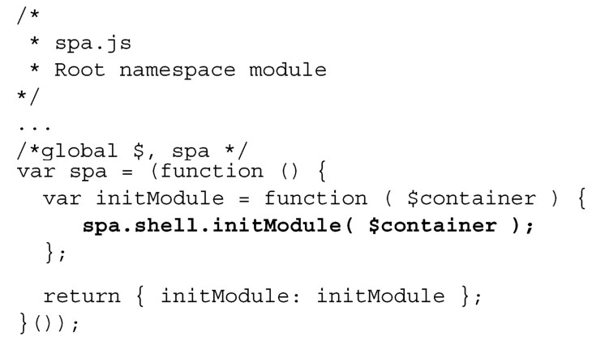
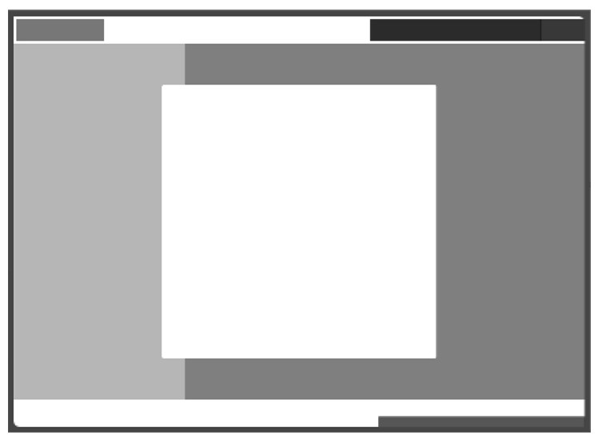

#### 
  3.4.4 指示应用使用Shell

现在我们来修改根名字空间模块（spa/js/spa.js），以便使用Shell，而不是费力地把“hello world”复制到DOM中去。按照下面粗体所示的进行修改就可以了：

现在打开浏览文档（spa/spa.html），应该能看到和图3-6一样的界面。可以使用Chrome开发者工具来确认单页应用生成的文档（spa/spa.html）和布局文档（spa/layout.html）是相符合的。

有了这个基础，我们将开始做让Shell来管理功能容器的工作。可能现在是好好休息一下的美好时光，因为下一小节相当有挑战。

