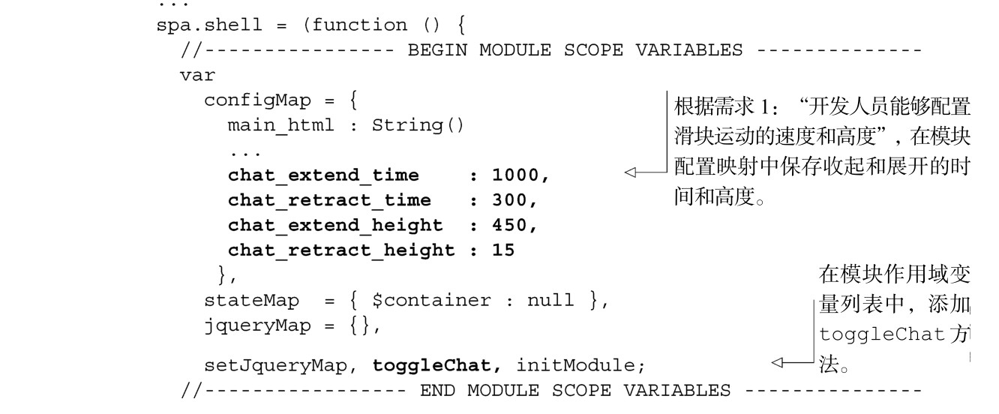
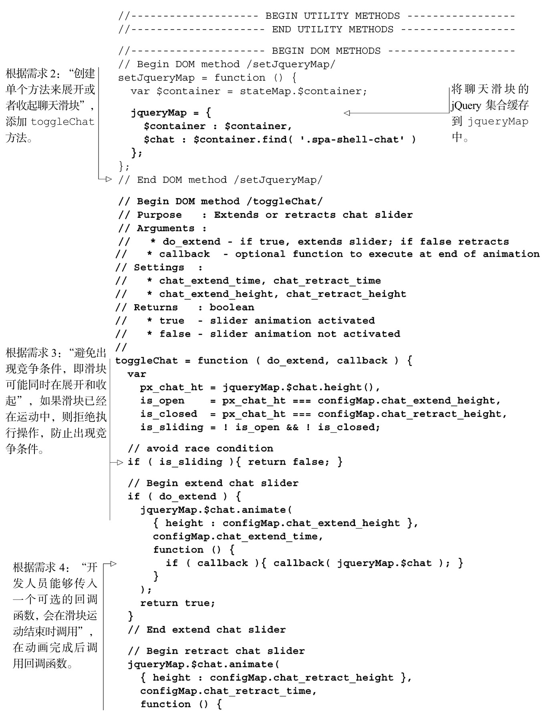
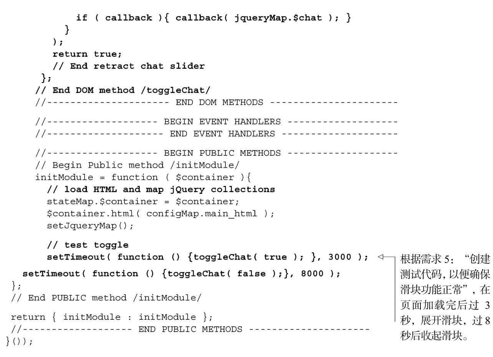

#### 
  3.5.1 编写展开或收起聊天滑块的方法

我们对聊天滑块函数的要求是适度的。我们需要它具备产品级的质量，但不用过度设计。下面是我们想要完成的需求。

（1）开发人员能够配置滑块运动的速度和高度。

（2）创建单个方法来展开或者收起聊天滑块。

（3）避免出现竞争条件（race condition），即滑块可能同时在展开和收起。

（4）开发人员能够传入一个可选的回调函数，会在滑块运动结束时调用。

（5）创建测试代码，以便确保滑块功能正常。

为满足这些需求，我们来修改一下Shell，如代码清单3-11所示 <a class="my_markdown" href="['#anchor2']">[2]</a>。所有的更改以粗体显示。请留意一下注释，因为它们详细地说明了和需求相关的更改。

代码清单3-11 为展开和收起聊天滑块而修订的Shell——spa/js/spa.shell.js

如果你正在运行这个示例，首先请在命令行中输入 jslint spa/js/spa.shell.js，使用 JSLint 来检查一下代码，不应该看到任何警告和错误。接着，请重新加载浏览文档（spa/spa.html），并看到 3秒过后，聊天滑块会展开，8秒过后又会收起。现在已经能让滑块动起来了，我们可以使用鼠标点击的方式来切换它的位置。

