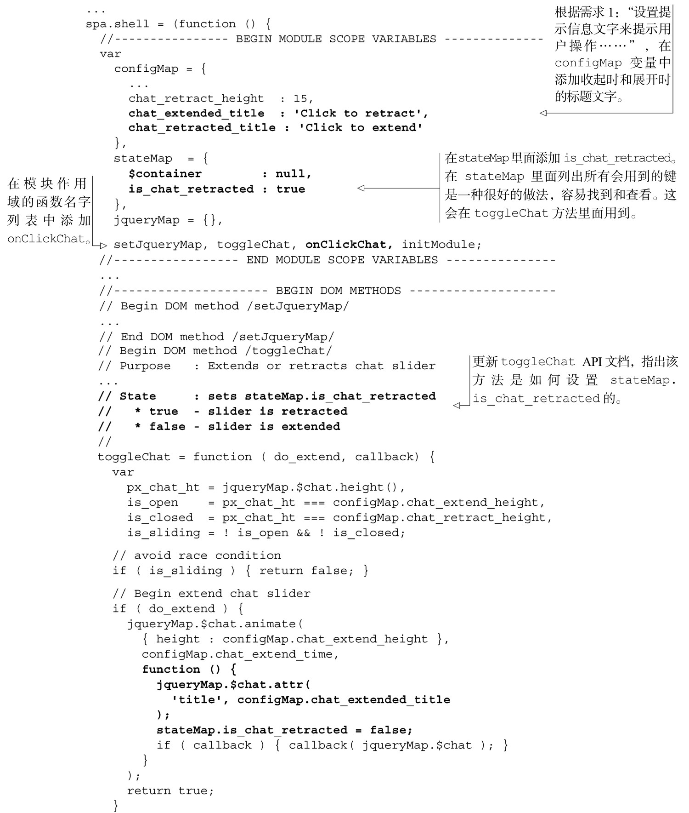
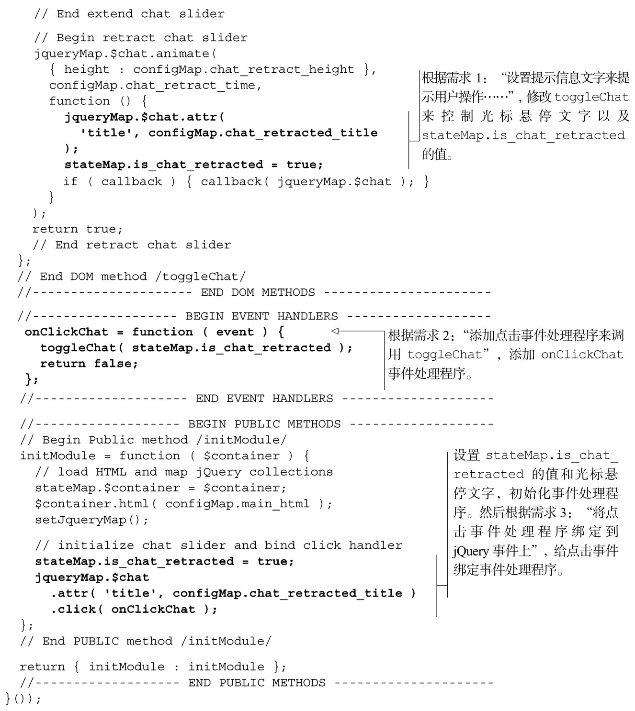
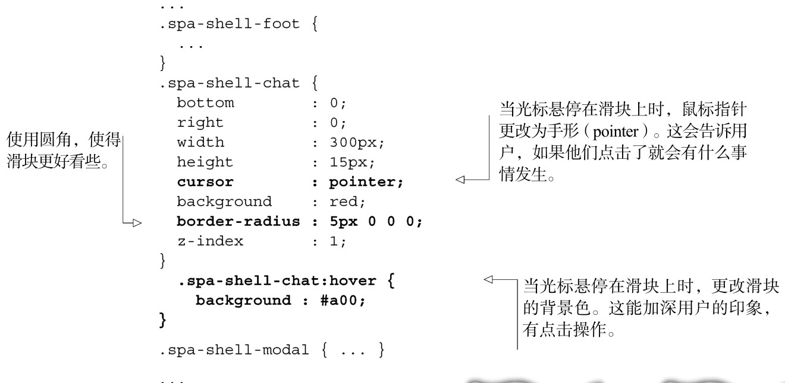
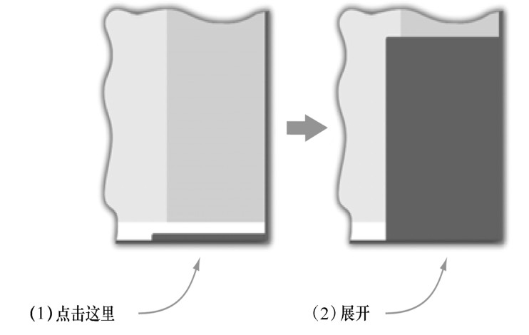
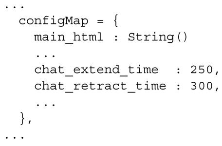

#### 
  3.5.2 给聊天滑块添加点击事件处理程序

很多用户希望在聊天滑块上点击就能展开或者收起，因为这是常见惯例。下面是我们想要完成的需求：

（1）设置提示信息文字来提示用户操作，比如“Click to retract”。

（2）添加点击事件处理程序来调用toggleChat。

（3）将点击事件处理程序绑定到jQuery事件上。

为满足以上需求，我们来修改一下Shell，如代码清单3-12所示。所有的更改还是用粗体显示，注解详细地说明了和需求相关的更改。

代码清单3-12 为处理聊天滑块的点击事件而修订的Shell——spa/js/spa.shell.js

正在运行这个示例的读者，可以再次在命令行中输入jslint spa/js/spa.shell.js来检查代码。我们仍然不应该看到任何警告和错误。

有个至关重要的 jQuery 事件处理程序的问题要记住：jQuery 会解读返回值，以便确定是否继续处理这个事件。我们通常在jQuery事件处理程序中返回false。下面是它要做的工作。

（1）告诉 jQuery 阻止正在操作的对象的默认行为，像点击链接或者选择文字。可以在事件处理程序中调用event.preventDefault()来获得相同的效果。

（2）告诉jQuery停止该事件触发父DOM元素上的相同事件（这个行为通常叫做冒泡）。可以在事件处理程序中调用event.stopPropagation()来获得相同的效果。

（3）结束事件处理程序的执行。如果在这事件之后，被点击的元素还绑定了其他的事件处理程序，则事件队列中的下一事件会被调用（如果不想执行后续的事件处理程序，可以调用event.preventImmediatePropagation()）。

这三个动作经常是我们希望事件处理程序要做的。很快我们就会编写不想要这些动作的事件处理程序。那些事件处理程序将会返回true值。

Shell没有必要处理点击事件。它可以给Chat模块提供一个操作滑块的回调函数，我们鼓励这么做。但是因为我们还没有编写Chat模块，所以现在就在Shell里面处理点击事件。

现在给Shell添加一些时髦的样式。代码清单3-13演示了所做的更改。

代码清单3-13 给Shell 添加一些时髦的样式——spa/css/spa.shell.css

当重新加载浏览文档（spa/spa.html）时，可以点击滑块，看到它会展开，如图3-7所示。

滑块展开的速度比收起时慢得多。可以更改Shell（spa/js/spa.shell.js）中的配置，来改变滑块的速度，比如：

在下一节，我们将对应用进行修改，以便更好地管理它的状态。当完成这项工作的时候，对于聊天滑块，所有的浏览器功能，像书签、前进和后退按钮，如用户预期的一样，都可以正常使用了。

