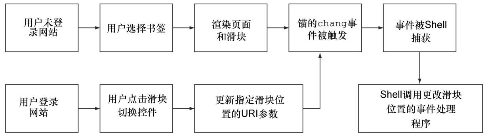

#### 
  3.6.2 选取一个策略来管理历史控件

支持历史控件的最优策略应该满足以下需求。

（1）按照表3-1，历史控件应该如用户所期望的一样工作。

（2）支持历史控件的开发工作，应该合理低廉。对比没有历史控件时的开发工作，它不需要更多的时间和复杂度。

（3）应用应当表现良好。因此，应用对用户操作的响应不应更长，用户界面不应更复杂。

我们使用下面的用户交互作为示例，考虑一下使用聊天滑块的一些策略。

（1）Susan访问了我们的单页应用，点击聊天滑块来打开它。

（2）她将单页应用添加为书签，然后浏览了其他网站。

（3）之后，她决定回到我们的应用，于是点击了她的书签。

我们考虑三种策略，使得Susan的书签按预期工作。请不要为记住它们而担心，我们只是想展示它们的相对优点 <a class="my_markdown" href="['#anchor3']">[3]</a>：

策略1 ——点击时，事件处理程序直接调用toggleChat程序，忽略URI。当Susan回来点击她的书签时，滑块会在它默认的位置显示，即是关闭的。Susan不高兴了，因为书签没有按预期工作。开发人员James也不高兴，因为他的产品经理发现应用的可用性是无法接受的，正在纠缠着他。

策略2 ——点击时，事件处理程序直接调用toggleChat程序，然后修改URI来记录这个状态。当Susan回来点击她的书签时，应用必须识别URI里面的参数并按它行事。Susan高兴了。开发人员James不高兴了，因为现在他必须支持两种打开滑块的情形：一种是运行时的点击事件，一种是加载时的URI参数。James的产品经理也不开心，因为开发这种双路径（dual-path）的方法比较慢，容易产生bug和不一致性。

策略3——点击时，事件处理程序更改URI，然后立即返回。Shell的hashchange事件处理程序捕捉到了这个变化，并发送给toggleChat程序。当Susan回来点击她的书签时，URI由同段程序解析，打开的滑块被恢复。Susan高兴了，因为书签按预期工作了。开发人员James也高兴，因为他可以使用一条代码路径（code path）来实现所有可用书签标记的状态。James 的产品经理也高兴，因为开发很快并且相对来说不会有bug。

我们喜欢的解决方案是策略3，因为它支持所有的历史控件（需求1）。它满足并将开发事宜最小化（需求2）。当使用历史控件的时候，它只调整页面上需要更改的部分，保证了应用的性能（需求3）。这种使用URI来驱动页面状态的解决方案，我们叫做锚接口模式（anchor interface pattern），如图3-8所示。

我们在第4章会再来回顾这个模式。现在已经选择了策略，我们来实现它吧。

