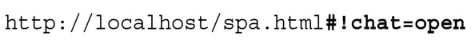
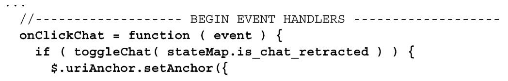
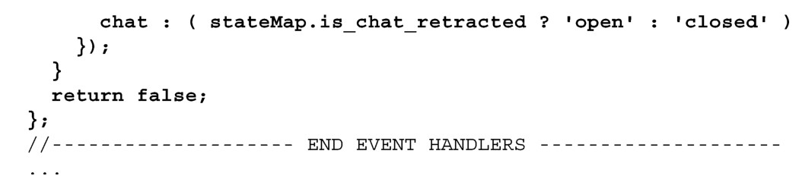
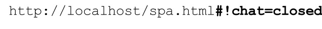

#### 
  3.6.3 当发生历史事件时，更改锚

URI 的锚组件指示浏览器显示页面的哪个部分。锚的其他常见名字是书签组件（bookmark component）或者哈希片段（hash fragment）。锚总是以“#”符号开头，如下面代码的粗体部分所示：

锚组件的传统用法是，开发人员使得用户能很容易地在一个很长的文档的章节之间“跳转”。比如，在网页的顶部有一个目录，所有的章节标题链向它们在文档中对应的章节。每个章节的最后可能有一个“回到顶部”的链接。博客和论坛仍然很广泛地使用这种机制。

锚组件的一个独特功能是，在它改变的时候，浏览器不会重新加载页面。锚组件是只给客户端使用的控件，它是保存应用状态的理想地方。很多单页应用都使用这个技巧。

我们把想保存在浏览器历史当中的应用状态变化称之为历史事件（history event）。因为我们认为开始或者结束聊天是历史事件（你错过了会议），可以让点击事件处理程序更改锚来表示聊天滑块的状态。可以使用uriAnchor这个jQuery插件来挑这大梁。我们来修改一下 Shell，用户点击后会更改 URI，如代码清单 3-14所示。所有更改以粗体显示。

代码清单3-14 uriAnchor jQuery 插件的用法——spa/js/spa.shell.js

现在，当点击滑块时，我们会看到URI会改变（但只在toggleChat成功返回true时）。比如，当点击聊天滑块，它会打开然后再关闭，看到的地址如下：

关于感叹号

示例中的URI，跟在哈希符号后的感叹号（#！），用于告诉Google 和其他搜索引擎，这个URI可被搜索索引。我们将会在第9章讲解更多关于搜索引擎的优化。

我们需要确保，当锚变化的时候，只改变应用需要改变的部分。这使得应用会快很多，当部分页面内容没必要清除和重新渲染时，避免了发生烦人的“闪烁”现象。比如，假设当Susan打开聊天滑块时，她正在查看上千名用户资料的列表清单。如果她点击了回退按钮，应用应该只关闭滑块，用户资料不应该重新渲染。

为了确定事件引起的变化是否值得支持历史功能，我们要问自己以下三个问题。

用户想把发生的变化添加为书签的愿望有多强烈？

用户想恢复到发生变化之前的页面状态的愿望有多强烈？

支持这一功能有多昂贵？

尽管使用锚接口模式来维护状态的增量成本通常较小，但也有些情形是很昂贵或者是不可能的。比如，在线购物，当用户点击回退按钮，回滚是非常困难的。在这种情形下，需要完全避免历史入口。幸运的是，uriAnchor插件支持这一功能。

