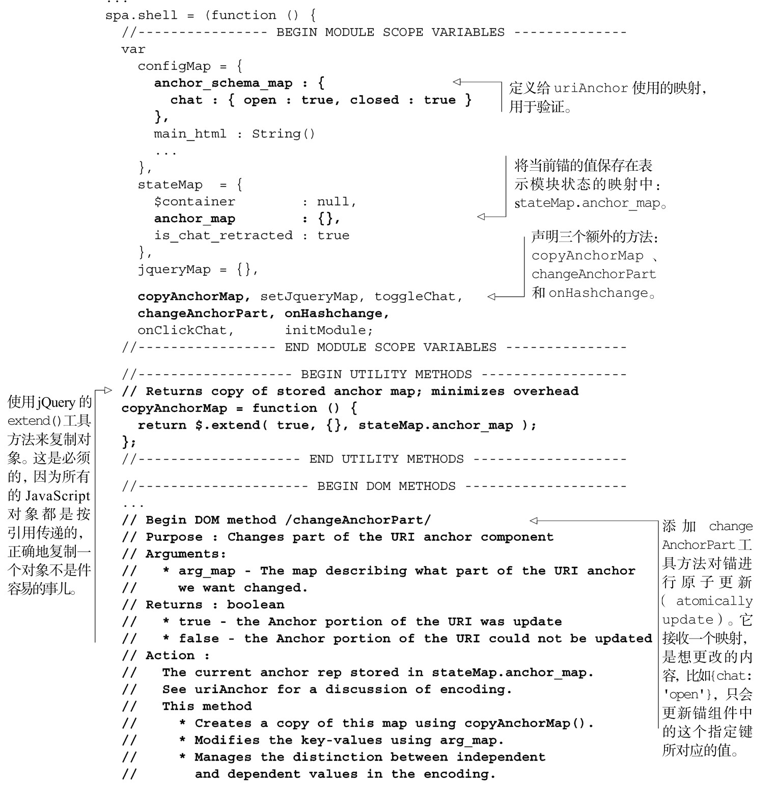
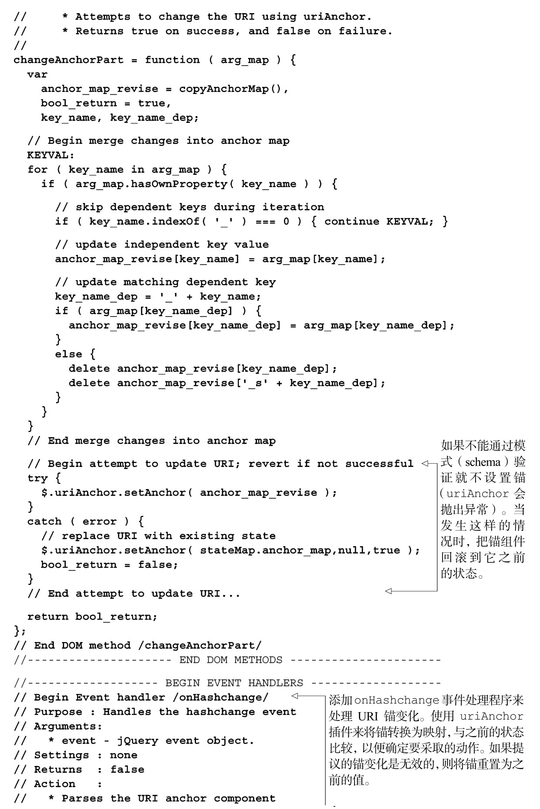
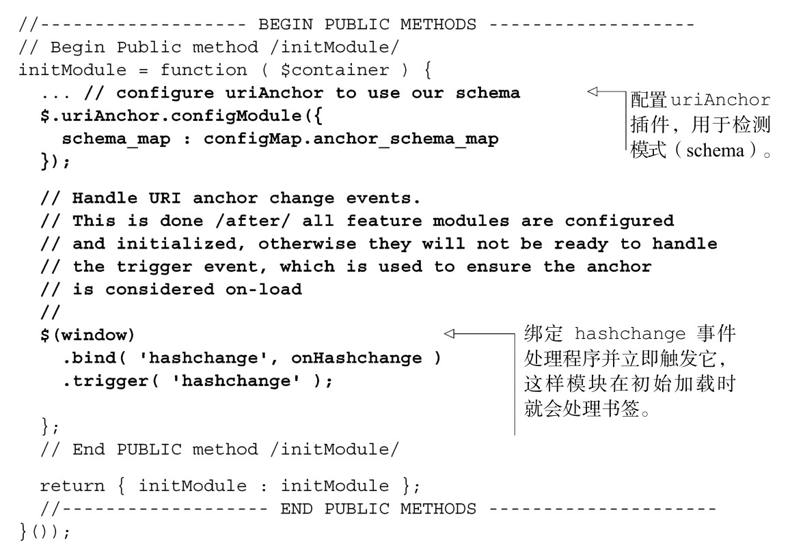
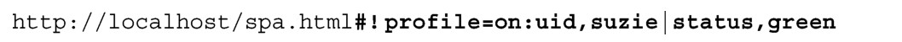
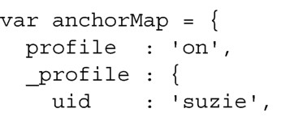
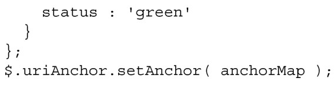
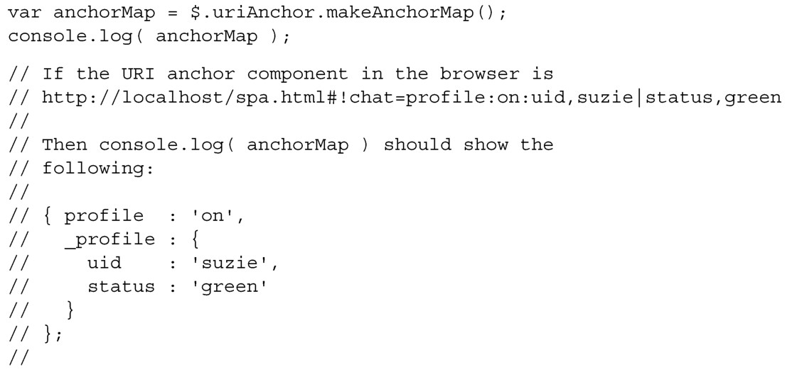

#### 
  3.6.4 使用锚来驱动应用状态

我们希望始终让锚组件来驱动可书签化的应用状态。这能确保历史功能一直按预期工作。下面的伪代码概括了我们是如何来处理历史事件的。

当发生历史事件时，更改URI的锚组件，以便体现更改的状态。

——接收事件的处理程序调用Shell的工具方法来改变锚。

——然后事件处理程序退出。

Shell的hashchange事件处理程序注意到了URI变化并按它行事。

——将当前状态和新的锚表示的状态做比较。

——根据比较确定的结果，尝试更改需要修改的应用部分。

——如果不能处理请求的变化，则保持当前的状态，并恢复锚，以便和状态匹配。

现在已经草拟了伪代码，我们来把它转换为真实代码。

1．更改Shell来使用锚组件

我们来修改一下Shell，使用锚组件来驱动应用的状态，如代码清单3-15所示。这里有许多新代码，但不要气馁，所有的代码都会在适当的时候加以解释。

代码清单3-15 使用锚来驱动应用的状态——spa/js/spa.shell.js

现在已经修改了代码，我们应该看到所有的历史控件（前进按钮、回退按钮、书签和浏览器历史）都会按预期工作。如果手动更改锚组件，参数或者值是不支持的，则它应该能“自我修复”。比如，请使用#!chat=barney来替换浏览器地址栏中的锚，然后按下回车。

现在历史控件已经可以工作，我们来讨论一下如何使用锚来驱动应用状态。我们先演示如何使用uriAnchor对锚进行编码和解码。

2．理解uriAnchor如何对锚进行编码和解码

我们使用jQuery的hashchange事件来识别锚组件的变化。应用状态是使用独立的（independent）和关联的（dependent）键值对的概念来编码的。以下面粗体部分显示的锚为例：

示例中独立的键是profile，它的值为on。再深层次地定义profile状态的键叫做关联的键，它们之间使用冒号（:）分隔符。这里包括了值为suzie的uid键和值为green的status键。

uriAnchor 插件，js/jq/jquery.uriAnchor-1.1.3.js，替我们编码和解码独立的和关联的值。可以使用$.uriAnchor.setAnchor()方法更改浏览器的 URI，以便满足早先的示例：

可以使用makeAnchorMap方法读取锚并解析为一个映射：

希望你现在能很好地理解如何使用uriAnchor来编码和解码URI锚组件所表示的应用状态。现在我们来仔细看一下如何使用URI锚组件来驱动应用状态。

3．理解锚的变化如何来驱动应用的状态

我们的历史控件策略是：改变可书签化状态的任何事件都要做以下两件事情。

（1）改变锚。

（2）立即返回。

我们在Shell里面添加了changeAnchorPart方法，当确保独立的和关联的键值被正确地处理时，它允许我们更新锚的部分内容。它集中并统一了管理锚的逻辑，它是应用中修改锚的唯一方法。

当我们说“立即返回”时，意思是在改变锚之后，事件处理程序的工作就完成了。它不会更改页面元素。它不会更新变量或者标志（flag）。不用再做其他事件。简单地直接返回给调用它的事件。这在onClickChat事件处理程序中已经作了说明：

事件处理程序使用changeAnchorPart来更改锚的chat参数，然后立即返回。因为锚组件改变了，浏览器会发出hashchange事件。Shell监听着hashchange事件，并会根据锚的内容执行操作。比如，如果Shell注意到chat值由opened更改为closed，它就会关闭聊天滑块。

你可能会认为（被changeAnchorPart方法修改的）锚是可书签化状态的API。这个方法的巧妙之处是它不关心为什么锚会改变，可以是应用修改的，或者是用户点击了书签，或者是点击了前进或后退按钮，或者是直接在浏览器地址栏里面输入的。随便哪种情况，它总是能正确地工作，并只使用单独的执行路径。

