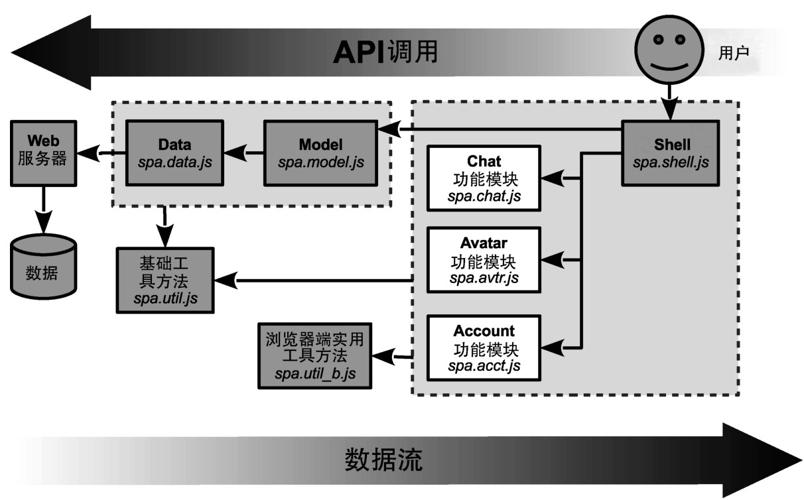

### 
  4.1 功能模块策略

在第3章中讨论的Shell，承担着应用范围的任务，像是管理URI锚或者cookie，把特定功能的任务调度给精心隔离的功能模块。这些模块有它们自己的视图、控制器和Shell在它们之间共享的部分模型。架构的概览如图4-1所示<a class="my_markdown" href="['#anchor4']">[4]</a>。

功能模块的例子包括在工作台上处理草图的spa.wb.js、管理账户功能的spa.acct.js （像登入或者登出）和用于聊天界面的spa.chat.js。由于Chat模块快要完成了，因此本章我们将重点讨论这个模块。

