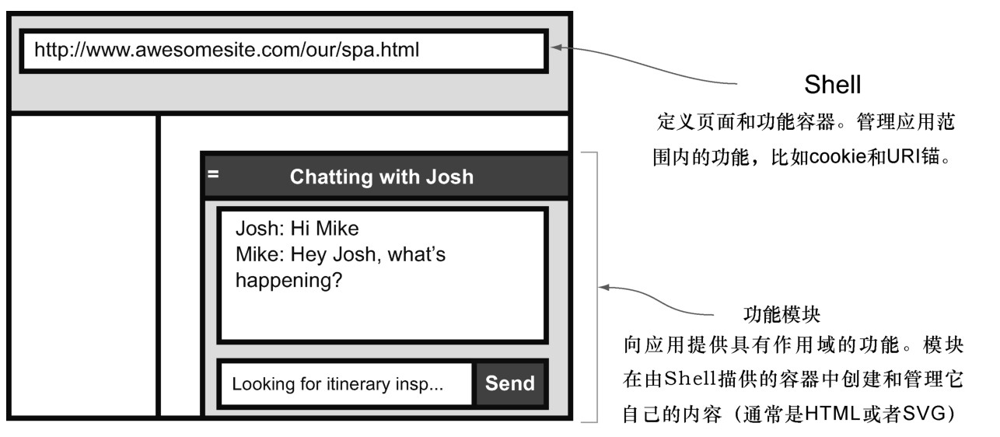

#### 
  4.1.1 与第三方模块的比较

功能模块很像第三方模块，为现代网站提供了各种各样的功能 <a class="my_markdown" href="['#anchor5']">[5]</a>。第三方模块的例子，包括博客评论型的（DisQus或者LiveFyre）、广告型的（DoubleClick或者ValueClick）、分析型的（ Google或者Overture ）、分享型的（ AddThis或者ShareThis ）和社交服务型的（Facebook的“Like”按钮或者Google的“+1”按钮）。它们都非常流行，因为网站管理员可以把这些高质量的功能添加到他们的网站里面，和自己来开发这些功能相比，这只需很少的成本、精力和维护 <a epub:type="noteref" href="#anchor6" id="ac6">[6]</a>。通常，通过在静态网页中引入脚本标签或者在单页应用里面添加一个函数调用来向网站添加第三方模块。若不是有第三方模块，很多网站上的许多功能都将不复存在，因为成本不允许。

精心编写的第三方模块具有以下共同特征。

它们在自己的容器内渲染，容器要么由别人提供，要么由它们自己添加到文档上。

它们提供了精心定义的API，以便控制它们的行为。

它们通过将自己的JavaScript、数据和CSS精心地隔离，避免污染主页面。

第三方模块也有一些缺点。主要的问题是这个“第三方”有它自己的商业目标，这可能和我们自己的目标是冲突的。这会从很多方面体现出来。

我们依赖于他们的代码和服务。如果他们失败了或者是破产了，他们的服务就没有了。如果他们把某个发布版本搞砸了，甚至可能会拖垮我们的网站。可悲的是，这种事情经常发生。

由于需要和服务器对话，或者是功能过剩，它们经常要比自定义的模块要慢。如果一个第三方模块慢了，它可能会使整个应用都变慢。

隐私是一件令人担心的事，因为每个第三方模块都有它自己的服务条款，他们的律师在里面几乎总是保留着瞬间更改通知的权利。

由于数据、样式的不匹配，或者缺乏灵活性，经常不能无缝地集成第三方功能模块。

如果不把第三方的数据集成到我们的单页应用里面，跨功能通信很难或者是不可能的。

定制的模块很难或者是不可能的。

我们的功能模块具有第三方模块的优点，但是由于我们没有使用第三方模块，所以也就避开了它们的缺点。这意味着对于一个给定的功能，Shell 会提供由功能模块填充和控制的容器，如图4-2所示。功能模块向Shell提供一致的配置、初始化和调用的API。通过使用唯一的和协调的JavaScript和CSS名字空间，功能之间相互隔离，除了共享的工具方法外，不允许任何外部调用。

把功能模块当作第三方模块一样来开发，能使我们从“第三方风格”的JavaScript中获益：

团队更加高效，因为开发人员可以根据模块来划分职责。让我们面对现实：如果你在一个团队里面工作，对于你来说，唯一的模块（非第三方模块），就是你负责的模块。不对模块负责的团队成员，要想使用它只需知道它的API即可。

应用常常表现良好，因为模块只管理它们所负责的应用部分，我们充分利用了它们，没有未使用的过剩功能，或者是不想要的功能。

代码维护和重用变得更加容易，因为模块被很好地隔离了。很多很复杂的jQuery插件（像日历），都是高效的第三方应用。请思考一下，和自己编写一个日历相比，使用第三方的日历是多么容易。

当然，像第三方模块一样来开发自己的模块，还有一个巨大的优势：我们处于一种有利的情况，Web应用的非核心功能使用第三方模块，然后在时间和资源允许时，有选择性地使用自己的功能模块来替换它们，这样就能更好地集成、运行更快、侵入性更小，或者是以上全部的好处。

