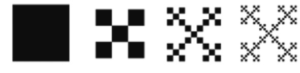
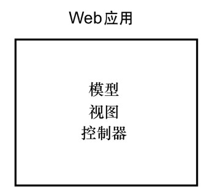
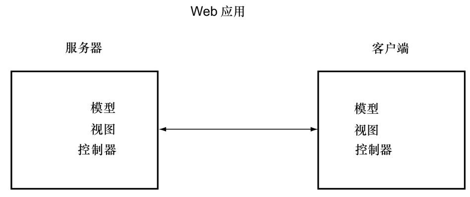
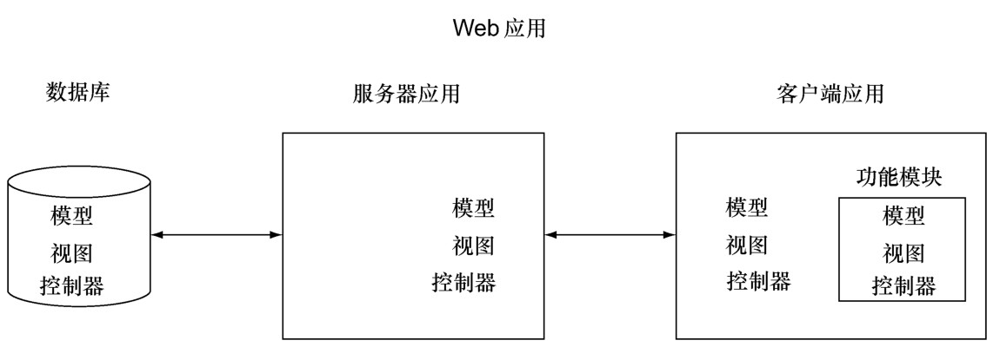
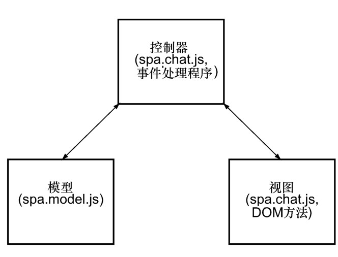

#### 
  4.1.2 功能模块和分形
  
    [7]
  
  MVC模式

很多Web开发人员都熟悉“模型-视图-控制器（MVC）”的设计模式，因为很多框架都使用了这种模式，比如Ruby on Rails、Django（Python）、Catalyst（Perl）、Spring MVC （Java）或者MicroMVC（PHP）。由于有如此多的读者熟悉这种模式，我们将会讲解我们的单页应用架构是如何同它关联起来的，尤其是功能模块。

我们来回忆一下，MVC是用来开发应用的一种模式。它的部件包括以下三个。

模型（Model），应用的数据和业务规则。

视图（View），模型数据的感官（通常是视觉的，但也常常是声音的）表现。

控制器（Controller），将用户的请求转换为命令，更新应用的模型和（或者）视图。

熟悉Web MVC框架的开发人员应该对本章的大部分内容感到很轻松。传统Web 开发人员对MVC框架的观点和我们的单页应用架构的最大区别如下。

我们的单页应用，尽可能多地把应用的功能移至浏览器端。

我们认为的MVC模式是重复的，就像是在分形中的一样。

分形是一种模式，它在所有层级上显示为自相似性（self-similarity）。图4-3演示的是一个简单的示例，从远处看到的是一般模式，当走近仔细看时，在更加精细的层级上，是重复的模式。

我们的单页应用架构在多个层级上采用重复的MVC模式，所以我们把它叫做“分形模型-视图-控制器”，或者是FMVC。这不是一个新的概念，开发人员使用这个相同的名字来讨论这个概念至少有十年了。我们理解的分形有多深，和看问题的角度有关。当从远处看我们的 Web 应用时，如图 4-4 所示，看到的是单一的 MVC 模式，控制器处理 URI和用户输入，与模型进行交互，在浏览器中提供视图。

当放大一点时，如图4-5所示，应用被分割为两部分：服务端采用MVC模式向客户端提供数据；采用MVC的单页应用允许用户查看浏览器端的模型，并与之交互。服务端的模型是从数据库获取的数据，而视图是要发送给浏览器的数据表现，控制器是协调数据管理和同浏览器通信的代码。在客户端，模型包括从服务器接收到的数据，视图是用户界面，控制器是协调客户端数据和界面的逻辑。

当再放大得近一点，如图4-6所示，我们看到了更多的MVC模式。比如，服务端应用采用MVC模式来提供HTTP数据API。服务端应用使用的数据库采用它自己的MVC模式。在客户端，客户端应用使用MVC模式，Shell调用的子功能模块本身也使用MVC模式。

几乎所有的现代网站都适用这种模式，即便开发人员没有意识到这一点。比如，一旦开发人员把DisQus或者LiveFyre的评论模块添加到他们的博客中（或者几乎是任何其他的第三方模块），他们就添加了另外一个MVC模式。

我们的单页应用架构信奉这种分形MVC模式。换句话说，我们的单页应用，不论是集成第三方功能，还是我们自己编写的功能模块，工作方式都是一样的。图 4-7 演示了Chat模块是如何采用它自己的MVC模式的。

我们已经讲解了功能模块是如何融入我们的架构的，它们和第三方模块的相似性，以及它们是如何采用分形MVC的。在下一节，我们会把这些思想运用在使用和创建第一个功能模块上。

