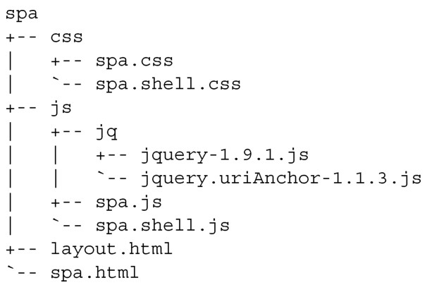
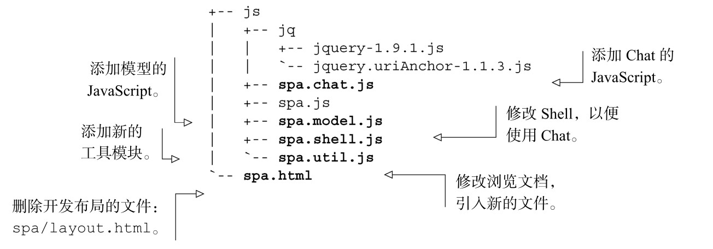

#### 
  4.2.1 规划文件结构

建议把在第3章创建的整个目录结构复制一份，放到一个新的“chapter_4”目录中，这样就可以在新目录中更新这些文件了。我们来回顾一下在第3章留下的文件结构，如代码清单4-1所示。

代码清单4-1 第3章的文件结构

下面是我们想要进行的更改。

为Chat模块创建一个有名字空间的样式表。

为Chat模块创建一个有名字空间的JavaScript模块。

为浏览器端的模型创建一个桩文件（stub）。

创建一个提供通用程序的公用模块，供其他所有模块使用。

修改浏览文档，引入新的文件。

删除用来开发布局的文件。

当完成上面的更改后，更新过后的文件和目录，看起来应该和代码清单4-2一样。所有创建或者修改的文件用粗体显示。

代码清单4-2 修改后的Chat 模块的文件结构

现在已经确定了想要添加或者修改的文件，让我们打开值得信赖的文本编辑器来把工作做完。我们会完全按照上面展示的顺序来考虑每一个文件。

