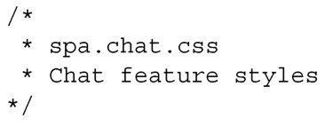
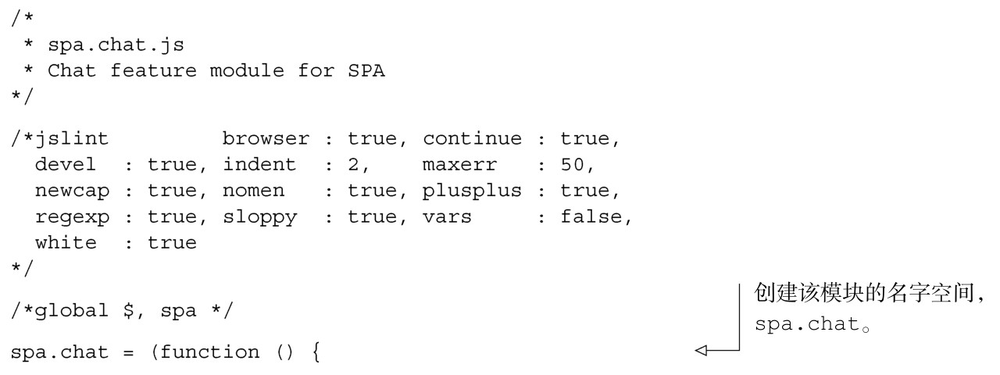
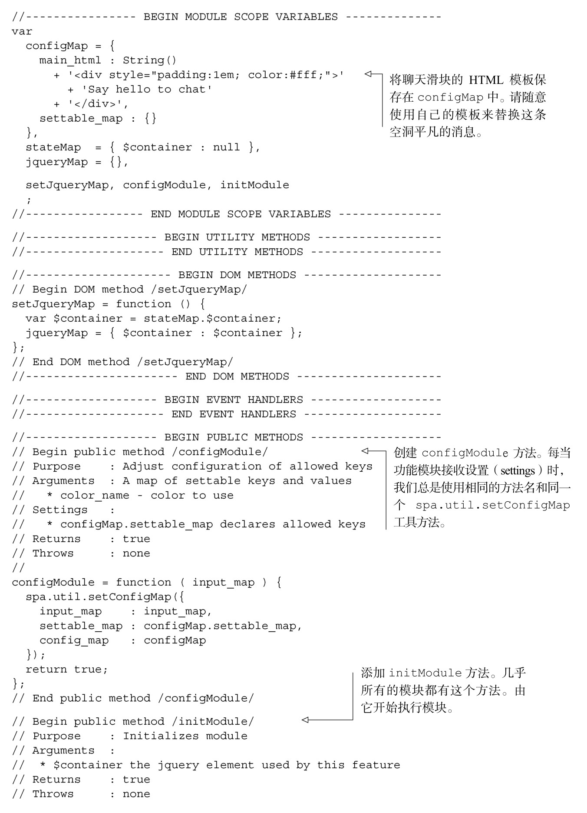
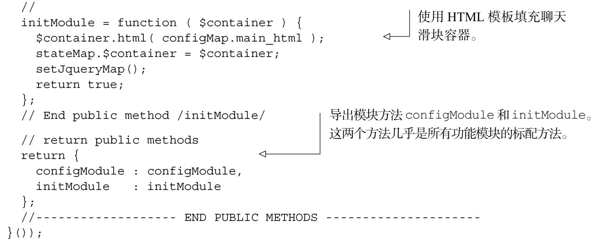
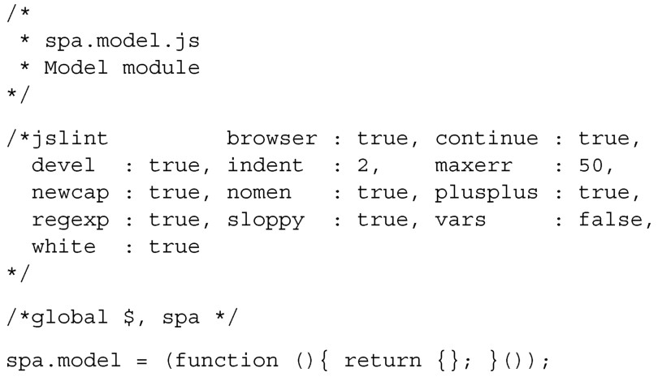
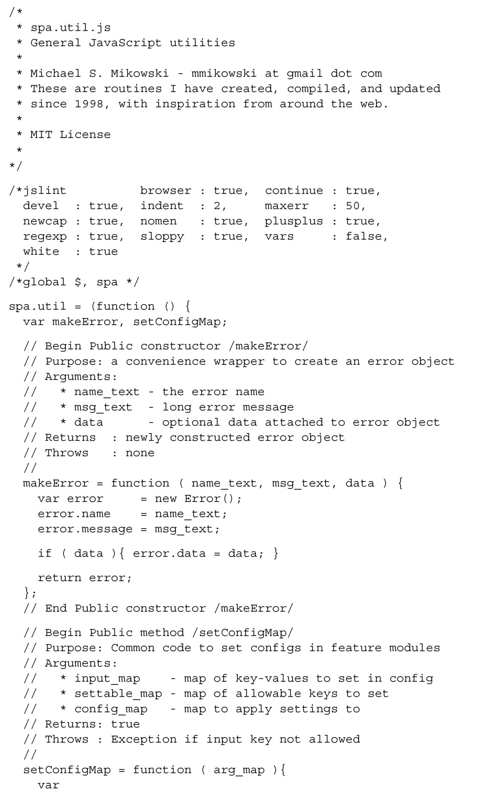
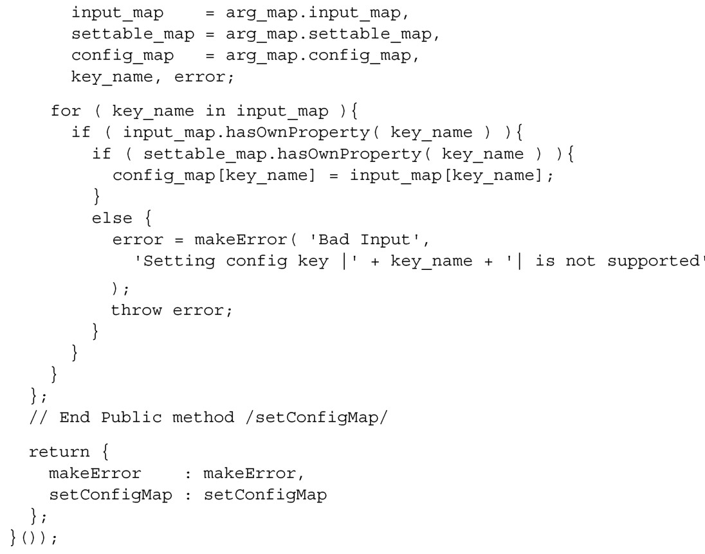
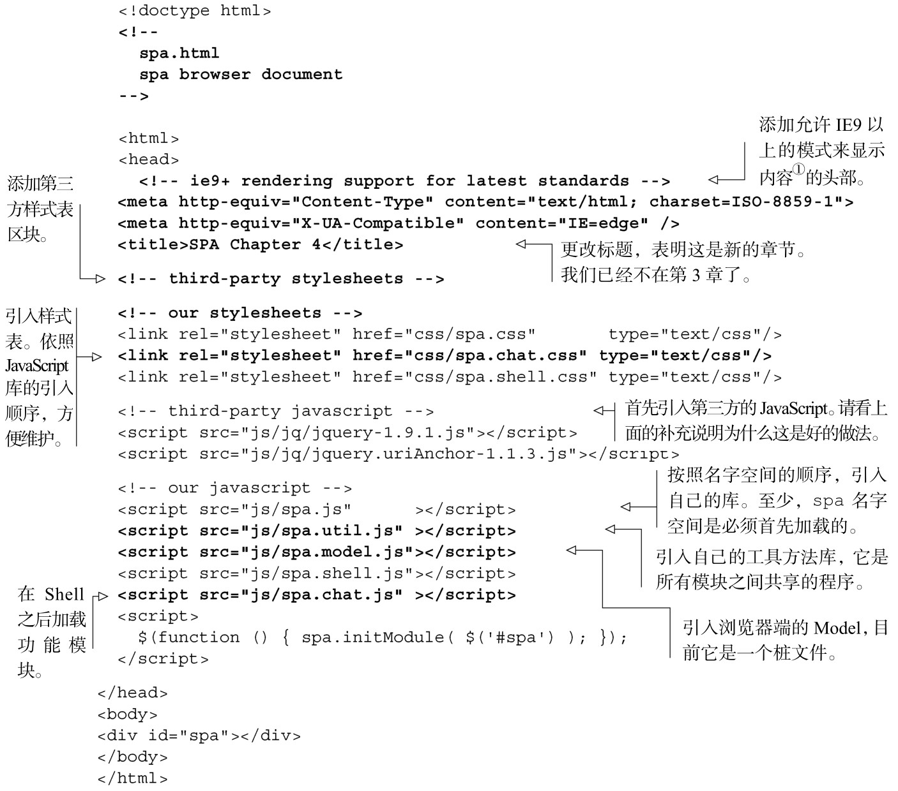

#### 
  4.2.2 填写文件

第一个要考虑的文件是Chat的样式表spa/css/spa.chat.css。我们将创建一个文件，填写如代码清单4-3所示的内容。最初，它是一个桩文件 <a class="my_markdown" href="['#anchor8']">[8]</a>。

代码清单4-3 样式表（桩文件）——spa/css/spa.chat.css

接下来使用附录A中的模块模板来创建Chat功能模块（spa/js/spa.chat.js），如代码清单4-4所示。这只是第一轮，我们会用一些HTML片段来填充聊天滑块容器。

代码清单4-4 功能有限的Chat 模块——spa/js/spa.chat.js

现在来创建Model<a class="my_markdown" href="['#anchor9']">[9]</a>模块，如代码清单4-5所示。它也是一个桩文件。和所有的模块一样，文件名（spa.model.js）表明了它提供的名字空间（spa.model）。

代码清单4-5 Model（桩文件）——spa/js/spa.model.js

我们来创建通用的工具模块，这样就可以在所有模块之间共享通用程序了，如代码清单 4-6 所示。makeError 方法可用来很容易地创建错误对象（error object）。setConfigMap 方法提供了一个容易的和一致的方式来更改模块的配置。因为这些是公开方法，我们详细描述了它们的用法，以方便其他开发人员。

代码清单4-6 通用工具方法——spa/js/spa.util.js

最后，可以把所有这些更改放在一起，通过修改浏览文档来加载新的JavaScript和CSS文件。首先加载样式表，然后加载JavaScript。JavaScript库的引入顺序很重要：首先要加载第三方库，因为它们经常是前提条件，并且这种做法也有助于避免偶然发生的和第三方库的名字空间冲突的低级错误（请看补充说明“为什么自己的库要放在最后加载”）。然后是加载我们的库，并且必须是按名字空间层级的顺序加载，比如，名字空间为 spa、spa.model和spa.model.user的模块，必须也按这个顺序加载。除此之外，其他的顺序只是约定，并无要求。我们喜欢这样的约定：根->核心工具方法->Model->浏览器端工具方法->Shell->功能模块。

为什么自己的库要放在最后加载

我们希望自己的库的名字空间是最终声明，所以在最后来加载它们。如果有一些“劣质”的第三方库声明了名字空间spa.model，当我们的库加载后，就能“把它夺回来”。如果发生了这样的情况，我们的单页应用能继续运行的可能性还是很大的，尽管第三方库的功能很可能无法工作。如果库的加载顺序是反过来的，我们的单页应用几乎确定是会被完全打垮。再说了，我们宁可去修复第三方的评论功能，而不是向CEO解释，为什么我们的网站在午夜的时候，会完全地停止工作。

我们来更新一下浏览文档，如代码清单4-7所示。以第3章的版本为基准，更改部分以粗体显示。

代码清单4-7 更改浏览文档——spa/spa.html

现在使用Shell来配置和初始化Chat，如代码清单4-8所示。所有的更改部分以粗体显示。<a class="my_markdown" href="['#anchor10']">[10]</a>

代码清单4-8 修改Shell——spa/js/spa.shell.js

现在已经完成了第一轮工作。虽然工作量很大，但是对于以后的功能模块，这些步骤有很多就不再需要了。现在来看一下我们创建了什么。

