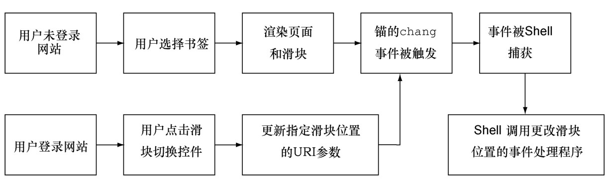

#### 
  4.3.1 锚接口模式

回忆一下第3章，我们希望一直由URI锚来驱动页面状态，而不是倒过来。有时候执行路径似乎很难理清楚，因为Shell负责管理URI锚，而Chat负责展示滑块。我们依赖锚接口模式来支持URI锚和用户事件驱动的状态，两者都使用了同一个jQuery hashchange事件。这种更改应用状态的单路径（single path），确保了历史可靠的URL<a class="my_markdown" href="['#anchor12']">[12]</a>、一致的行为以及有助于加快开发，因为只有一种状态更改机制。该模式如图4-10所示。

在上一章，我们已经实现了 Chat 的许多功能。现在我们把剩余的聊天功能代码移至它自己的模块。我们还会详细说明Chat和Shell都会用到的通信API。这能使我们立即从中获益，并且也能使得重用代码变得更加容易。API规范需要详细说明哪些资源是必需的，以及会提供什么功能。应该把它们当作“活文档（living document）”，每当更改API时，都要更新该文档。

我们希望Chat提供一个通用的公开方法configModule，我们会用这个方法在初始化之前更改配置信息。和每个功能模块一样，Chat通常有一个初始化方法initModule，然后我们会使用这个方法，指示该模块向用户提供它的功能。我们也希望 Chat 提供setSliderPosition方法，这样Shell就可以请求设置滑块的位置。我们会在接下来的几小节中设计这些方法的API。

