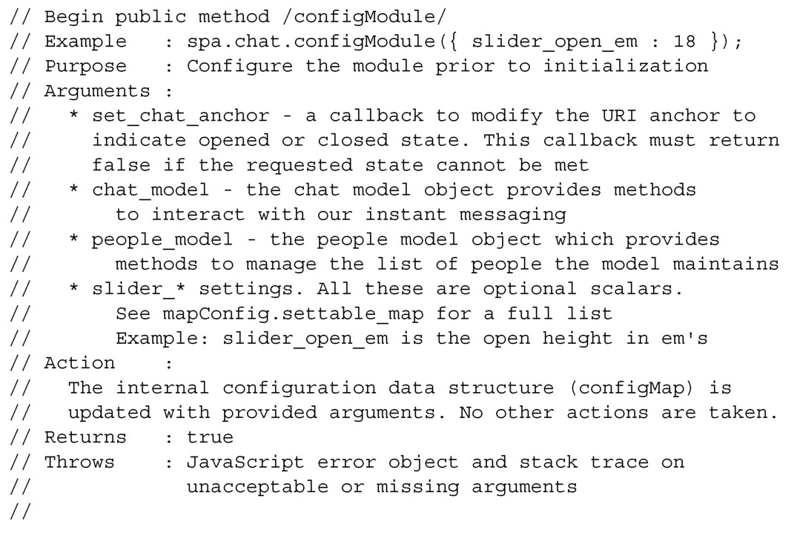
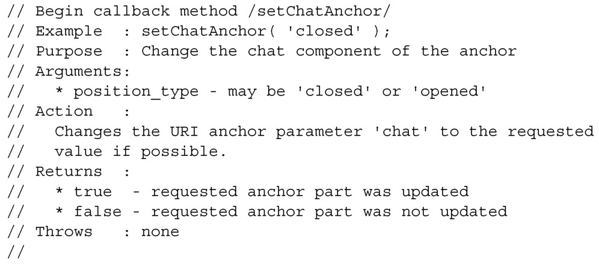

#### 
  4.3.2 Chat的配置API

在配置模块时，我们调整好的设置，不希望在用户会话期间发生变化。就Chat而言，下面的设置是符合这个标准的。

一个提供“修改URI锚中的chat参数”的功能的函数。

一个提供“发送和接收消息（来自Model）”的方法的对象。

一个提供“与一系列用户（来自Model）交互”的方法的对象。

许多行为设置，比如滑块打开时的高度，滑块的打开时间以及滑块的关闭时间。

JavaScript参数的内幕

请记住，只有简单值（字符串、数字和布尔值）是直接传递给函数的。JavaScript中的所有复杂数据类型（像对象、数组和函数）传递的是引用。这意味着，它们永远不会被复制（有些语言可以）。相反地，传递的是内存地址的值。这通常比复制要快很多，但负面影响是，它很容易意外地更改通过引用传递的对象或者数组。

当函数接收的参数是指向函数的引用，该引用通常叫做回调函数。回调函数很强大，但是它们也变得难以管理。我们会在第5章和第6章演示如何通过使用jQuery的全局自定义事件，减少回调函数的使用。

根据上面的这些期望，我们可以设计Chat的configModule API规范，如代码清单4-9所示。该文档不是给JavaScript使用的。

代码清单4-9 Chat 的configModule API 规范——spa/js/spa.chat.js

现在有了Chat的配置API，我们来设计Shell的setChatAnchor回调函数的规范。代码清单4-10是一个不错的起点。该文档不是给JavaScript使用的。

代码清单4-10 Shell 的setChatAnchor 回调函数的API 规范——spa/js/spa.shell.js

现在已经完成了Chat的配置API和Shell的回调函数API的设计，我们继续来设计Chat的初始化API。

