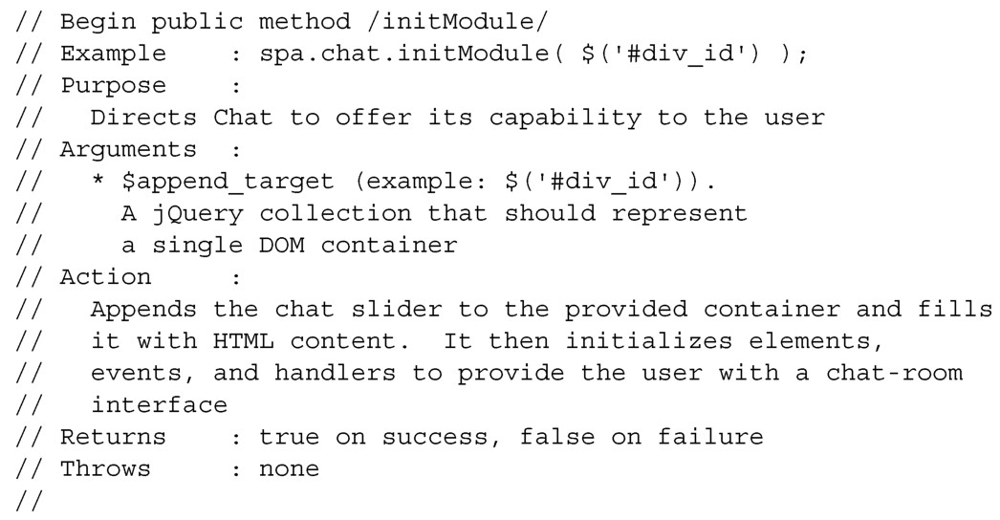

#### 
  4.3.3 Chat的初始化API

当初始化一个功能模块时，我们要求它渲染HTML，并且开始向用户提供功能。和配置不一样，我们期望在一个用户会话期间，可以多次初始化功能模块。至于Chat，我们希望传递单个jQuery集合作为参数。jQuery集合包含一个元素，即想在其上添加聊天滑块的那个元素。我们来概述一下API，如代码清单4-11所示。该文档不是给JavaScript使用的。

代码清单4-11 Chat 模块的initModule API 规范——spa/js/spa.chat.js

本章要详细说明的最后一个API是Chat的setSliderPosition方法。该方法用于打开和关闭聊天滑块。在下一小节，我们将继续设计这个API。

