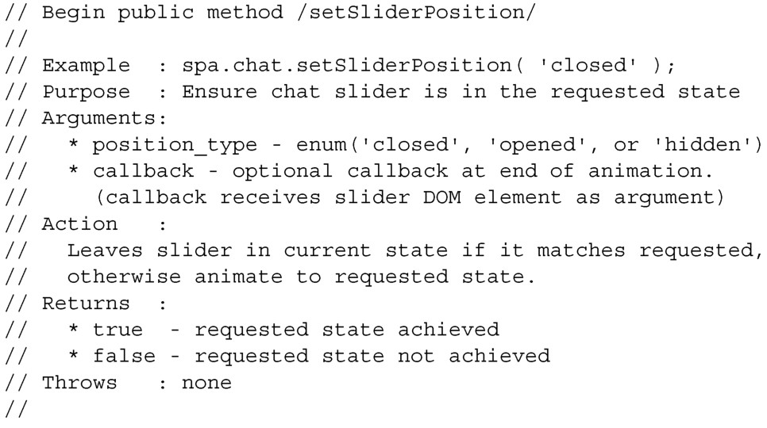

#### 
  4.3.4 Chat的setSliderPosition API

我们已经决定让Chat提供一个公开方法setSliderPosition，这将使得Shell能够请求设置滑块的位置。将滑块的位置信息放在URI锚中的决定，引出了一些有意思的、需要处理的问题。

Chat不总能将滑块调整到请求的位置。比如，它可以决定不打开滑块，因为用户没登录。我们会让setSliderPosition返回true或者false，这样的话Shell就能知道请求是否成功。

如果Shell调用setSliderPosition回调函数，并且回调函数不能执行请求（换句话说，它返回了false），则Shell需要把URI锚中的chat参数恢复到请求之前的值。

我们来详细地说明一下 API，如代码清单 4-12 所示，这满足了上面的需求。该文档不是给JavaScript使用的。

代码清单4-12 Chat 的setSliderPosition API 规范——spa/js/spa.chat.js

定义了这个API后，我们几乎已经为编写代码做好了准备。但是在编写代码之前，我们来看一下配置和初始化在应用中是如何级联（cascade）的。

