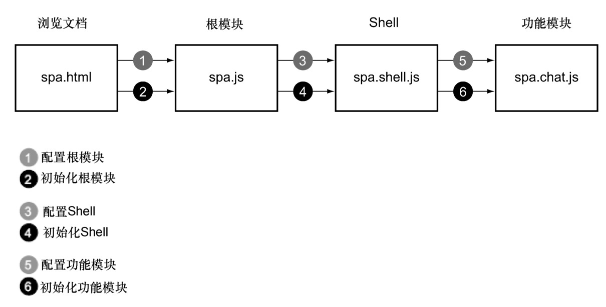
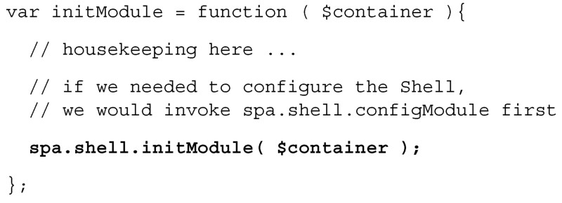
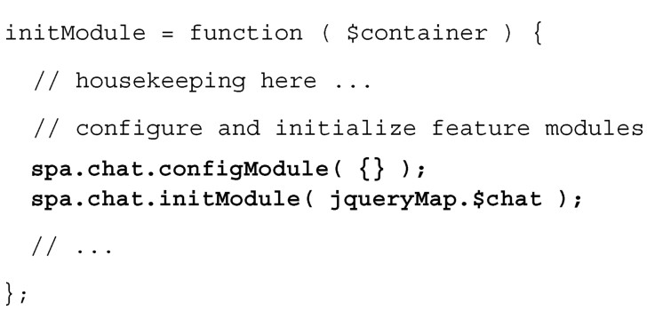

#### 
  4.3.5 配置和初始化的级联

我们的配置和初始化，遵循常见的模式。首先，浏览文档中的一个脚本标签会配置和初始化根名字空间模块：spa.js。然后，根模块配置和初始化 Shell 模块：spa.shell.js。然后Shell模块配置和初始化功能模块：spa.chat.js。这种级联的配置和初始化，如图4-11所示。

所有的模块都有公开的 initModule 方法。只在需要支持设置时，才会提供configModule方法。在现阶段的开发中，只有Chat是可以被配置的。

当加载浏览文档（spa/spa.html）时，它加载了所有的CSS和JavaScript文件。接着页面中的一个脚本会做初始的内务工作，并初始化根名字空间模块（spa/js/spa.js），提供一个页面元素（spa div）供其使用：

在初始化时，根名字空间模块（spa/js/spa.js）做了所有根级别的内务工作，然后再配置和初始化Shell（spa/js/spa.shell.js），提供一个页面元素（$container）供其使用:

然后Shell（spa/js/spa.shell.js）会做所有Shell级别的内务工作，配置和初始化所有的功能模块，如Chat（spa/js/spa.chat.js），提供一个页面元素（jqueryMap.$chat）供其使用：

对这种级联的方式感到愉悦是很重要的，因为所有的功能模块都采用了相同的方式。比如，我们可能希望把 Chat（spa/js/spa.chat.js）的一些函数分离出来，放至一个处理在线用户列表的子模块中去（我们称之为Roster），并创建文件spa/js/spa.chat.roster.js。然后，让Chat使用spa. chat.roster.configModule 方法来配置模块，使用spa.chat.roster.initModule方法来初始化模块。Chat也会向Roster提供一个jQuery容器，用于显示用户列表。

现在已经明白配置和初始化的级联方式，我们就可以准备更新应用，实现已经设计好的API。我们将会做一些更改，期间会破坏些东西，所以如果你正在运行示例的话，请不要惊慌，我们马上就会解决问题。

