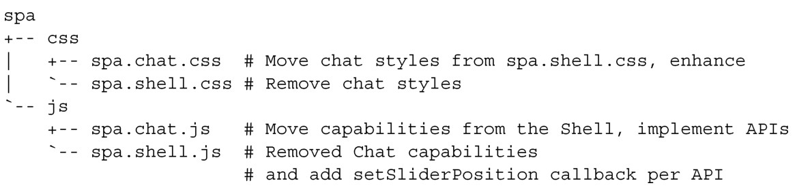

### 
  4.4 实现功能API

这一节，我们的主要目标是实现已经定义好的API。又因为代码已经完成得差不多了，我们再考虑一些其他目标。

把Chat的配置和实现完全移至它自己的模块中。对于Chat，Shell唯一要关心的是URI锚的管理。

更新聊天功能，使之看上去更加，呃，“健谈”吧。

我们要更新的文件以及它们需要如何更改的简易说明，如代码清单4-13所示。

代码清单4-13 在实现API期间会更改的文件

我们会完全按照上面显示的顺序来修改这些文件。

