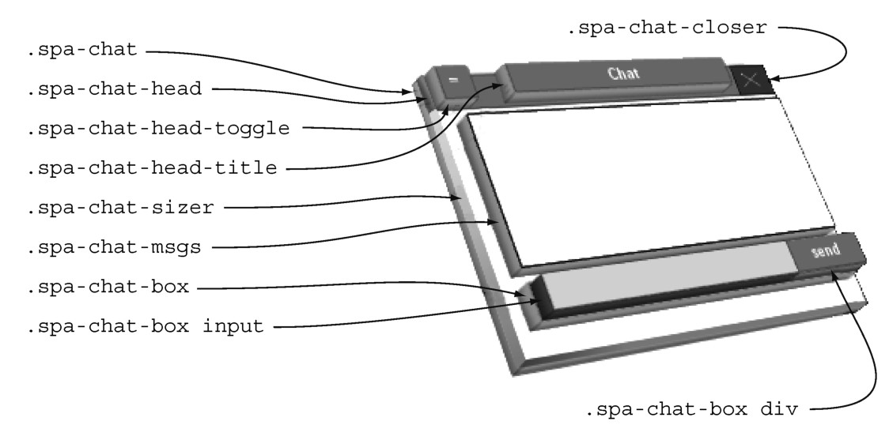
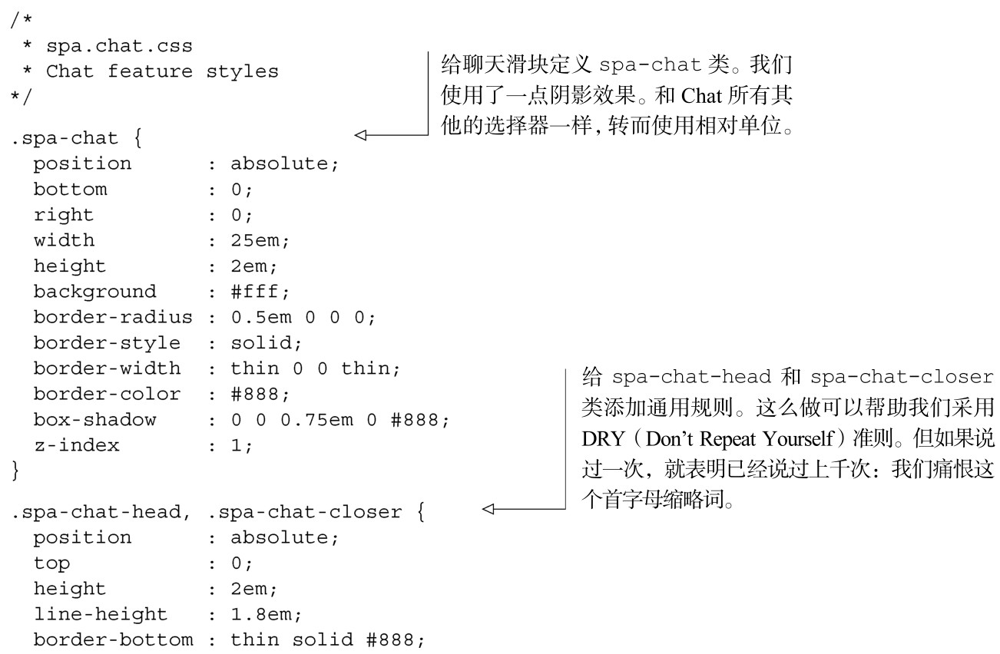
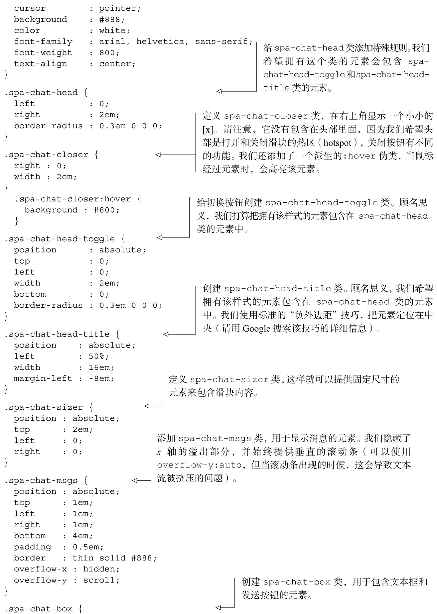
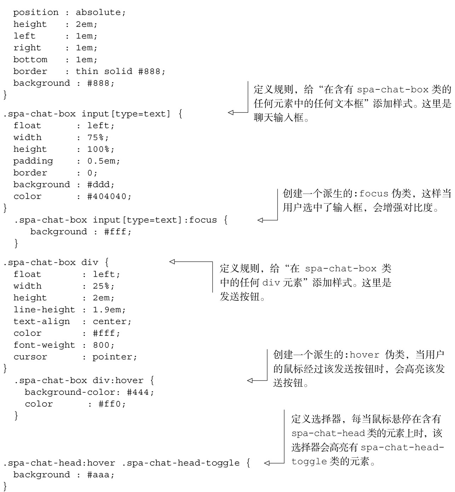
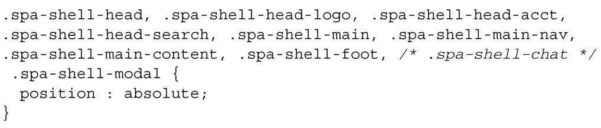
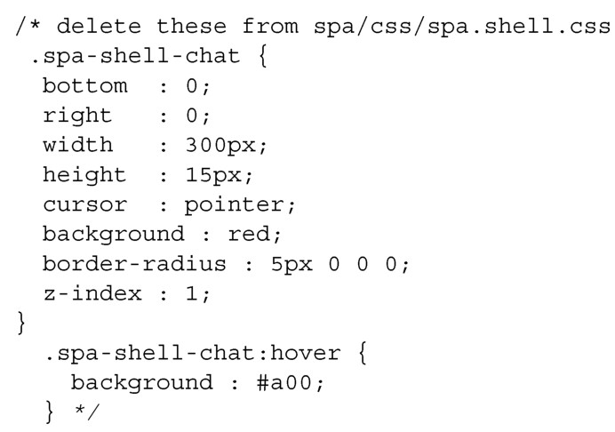
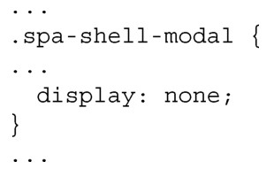

#### 
  4.4.1 样式表

我们想把 Chat 的所有样式移至它自己的样式表文件（spa/css/spa.chat.css）中，并且顺便改进一下布局。我们的本地CSS布局专家已经提供了一个好方法，如图4-12所示。

请注意我们是如何给 CSS添加名字空间的，和 JavaScript的做法一样。这有许多的好处。

我们不用担心和其他模块的冲突，因为对于所有的类名，保证有一个唯一的前缀：spa-chat。

与第三方包的冲突也几乎避免了。即便如果有某些意外的情况没有避免，修复（更改前缀）也是微不足道的。

极大地有助于调试，因为在查看由Chat控制的元素时，它的类名向我们表明源功能模块是spa.chat。

名字暗示了什么包含了（因此控制着）什么。比如，我们注意到，spa-chat-head包含spa-chat-head-toggle，而spa-chat又包含spa-chat-head。

大多数的样式都是样板代码 <a class="my_markdown" href="['#anchor13']">[13]</a>（对不起，CSS布局专家）。但有几个点使得我们的工作很特别。首先，spa-chat-sizer元素需要一个固定的高度。这会为聊天区域和消息区域预留空间，即使是在滑块收起的时候。如果没有这个元素，在滑块收起的时候，滑块内容会“挤成一堆”，这最会困扰用户。其次，布局人员希望移除所有和绝对像素有关的东西，支持使用相对量度，比如em和百分比。这使得我们的单页应用在低分辨率和高分辨率的显示器上面能有相同的呈现。

像素和相对单位的对比

HTML专家（guru）在开发CSS的时候，经常会经受使用相对量度的严重曲解：完全避免使用px单位，这样他们的创作成果就能在任何尺寸的显示器上面工作得很好。我们已经观察到一个现象，使我们重新考虑这种努力的价值：浏览器对像素大小很随意。

考虑一下最近的笔记本电脑、平板电脑和智能手机的超高分辨率显示屏。这些设备上的浏览器中的px值，和可用的物理屏幕像素没有直接的关系。相反，它们会对px单位进行标准化，这样的话，视觉体验接近传统桌面显示器，像素密度为每英寸上的像素数在96～120。

结果是，一个10 px的正方形，经智能手机上的浏览器渲染后，每一边实际上可能是15或者20个物理像素。这意味着px也变成了一种相对单位，和所有的其他单位（%、in、cm、mm、em、ex、pt、pc）相比，它通常更加可靠。其他的设备，我们有一个10.1英寸的和7英寸的平板电脑，有相同的1280乘800分辨率，和相同的操作系统。一个400px的正方形，能适应10.1英寸的平板电脑屏幕，但不能适应7英寸的平板电脑。为什么？因为每个px使用的物理像素数量，在较小的平板电脑上更高。缩放比例似乎是，在较大的平板电脑，每个px为1.5个像素，在较小的平板电脑上，每个px是2个像素。

我们不知道将来会怎样，但最近感到使用px单位的内疚大大降低了。

在心中有了所有的计划后，现在可以在 spa.chat.css 中添加满足规范的 CSS，如代码清单4-14所示。

代码清单4-14 给Chat 模块添加增强的样式——spa/css/spa.chat.css

现在有了Chat的样式，我们可以移除之前在Shell样式表（spa/css/spa.shell.css）中定义的样式。首先，删除绝对定位选择器列表中的.spa-shell-chat。更改如下（可以删除注释）：

也可以把spa/css/spa.shell.css中所有的.spa-shell-chat类删除。有两处要删除的地方，如下所示：

最后，隐藏模态（modal）容器，这样它就不会妨碍聊天滑块了：

此时可以打开浏览文档（spa/spa.html）了，在Chrome开发者工具的JavaScript控制台中不会看到任何错误。但聊天滑块也不再可见。请保持冷静并坚持到底，在下一节完成Chat的修改后，就会修复这个问题。

