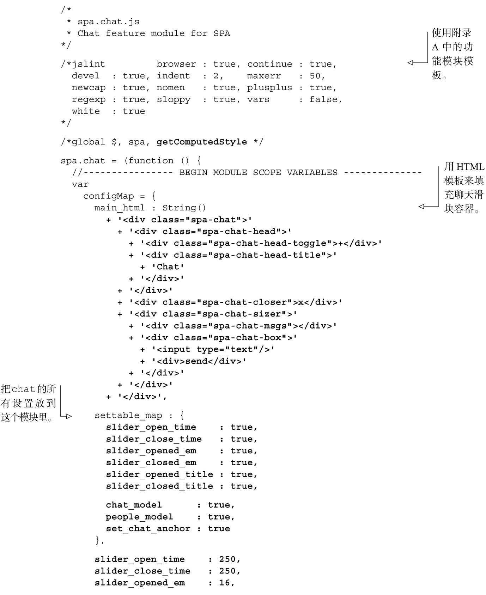
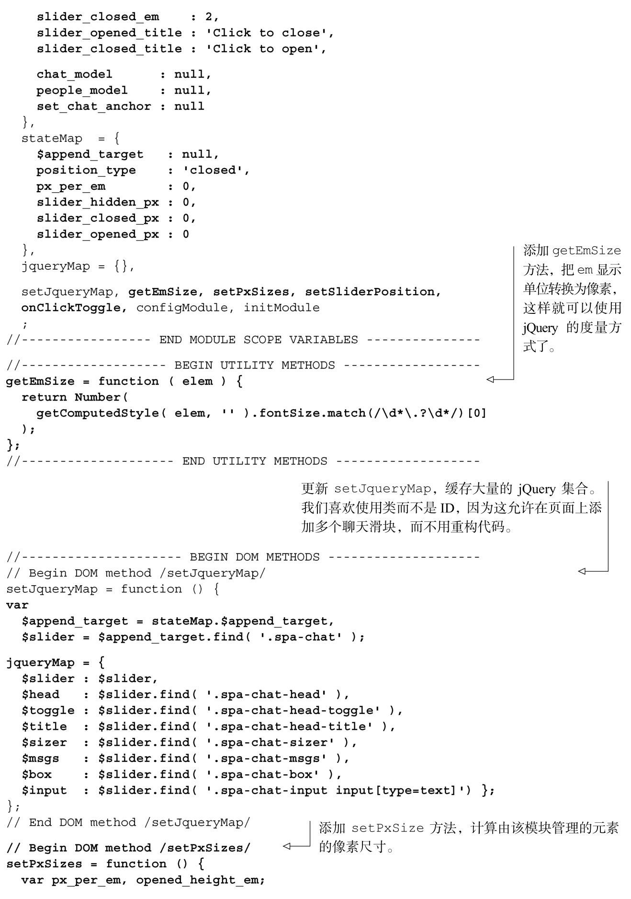
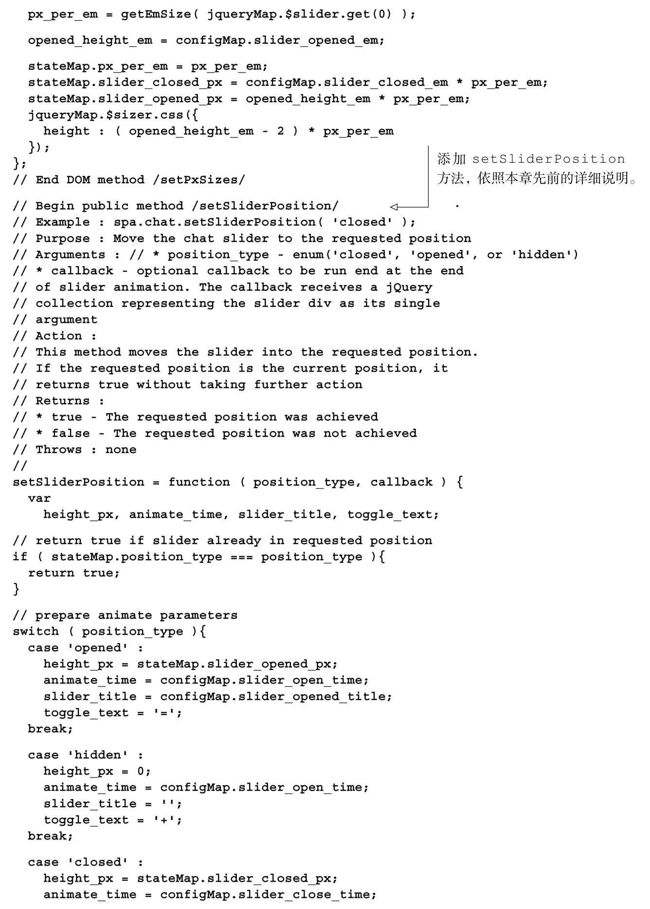
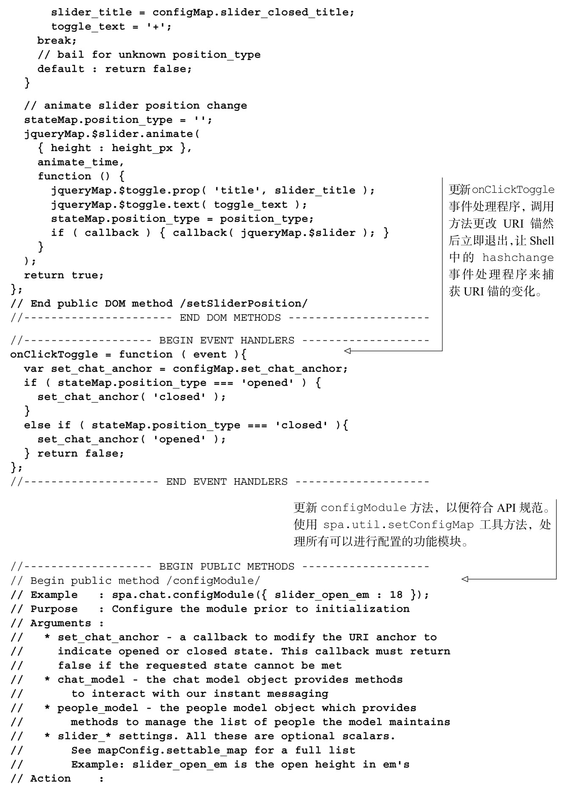
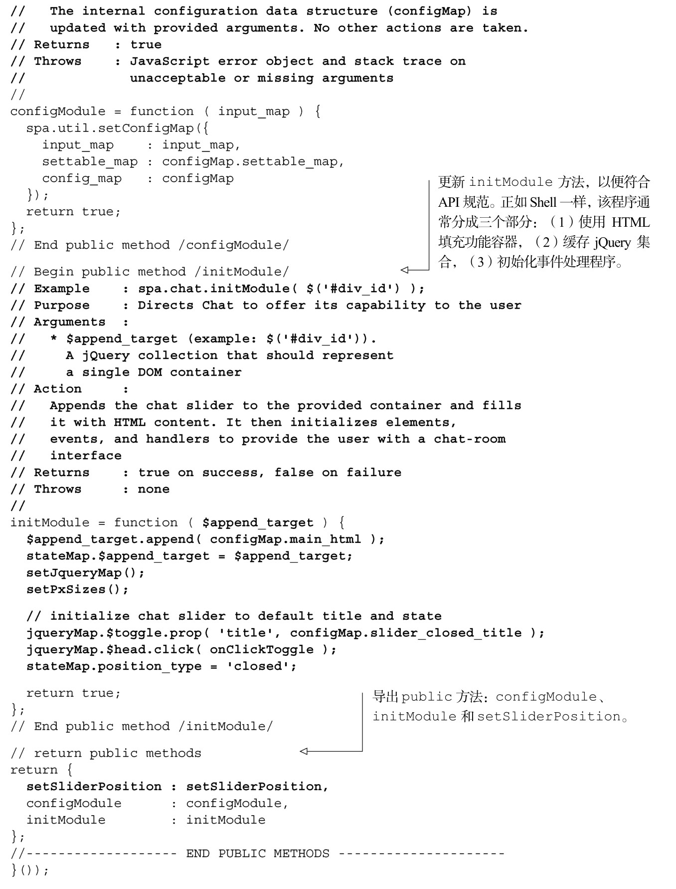

#### 
  4.4.2 修改Chat

现在我们将修改Chat，实现前面已经设计好的API。下面是计划要更改的。

为更精细的聊天滑块添加HTML。

扩展配置，引入像滑块高度和收起时间一样的设置信息。

创建getEmSize工具方法，将em单位转换为px（像素）。

更新setJqueryMap，把更新后的聊天滑块的许多新元素缓存起来。

添加setPxSizes方法，使用像素单位来设置滑块尺寸。

实现setSliderPosition公开方法，和API规范相匹配。

创建onClickToggle事件处理程序，更改URI锚并立即返回。

更新configModule公开方法的文档，和API规范相匹配。

更新initModule公开方法，和API规范相匹配。

我们来更新Chat，实现这些更改，如代码清单4-15所示。我们把前面已经设计好的API规范复制到了这个文件里面，在实现期间作为指南使用。在将来维护的时候，这能加快开发速度并保证文档是正确的。所有的更改部分以粗体显示。

代码清单4-15 修改Chat，使之符合API规范——spa/js/spa.chat.js

此时，可以加载浏览文档（spa/spa.html），在Chrome开发者工具的JavaScript控制台不会看到任何错误。我们看到聊天滑块的上面部分。但如果点击它的话，就会在控制台看到一个错误信息：“set_chat_anchor is not a function”。在下一小节清理了Shell后，就会修复这个问题。

