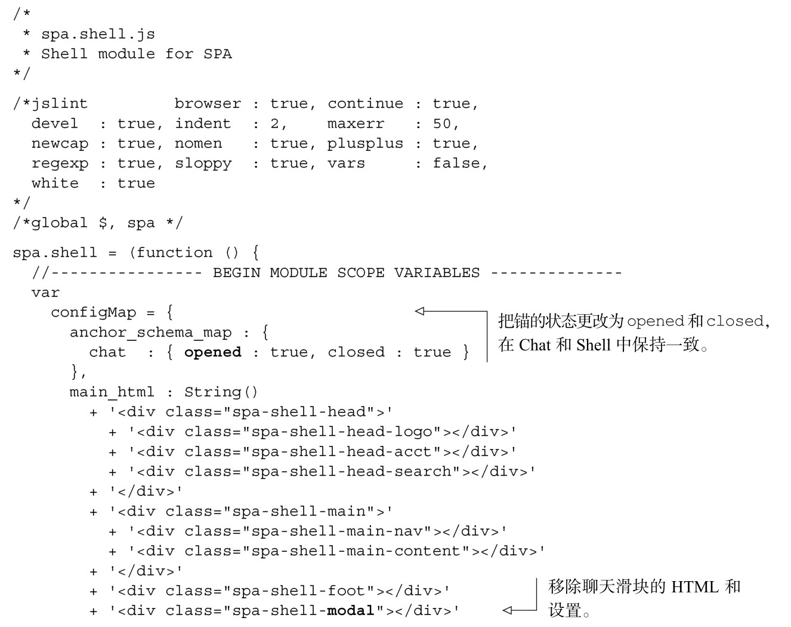
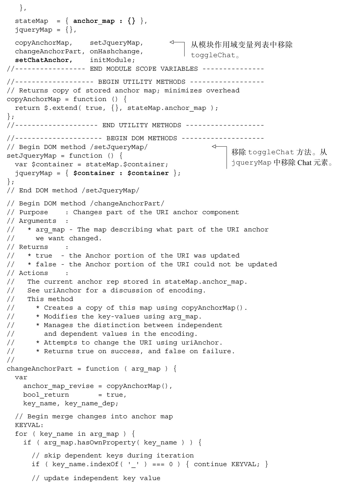
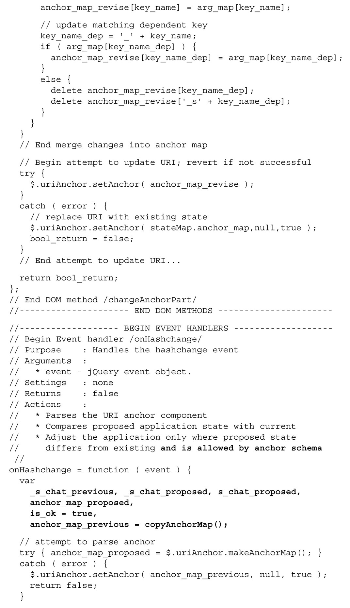
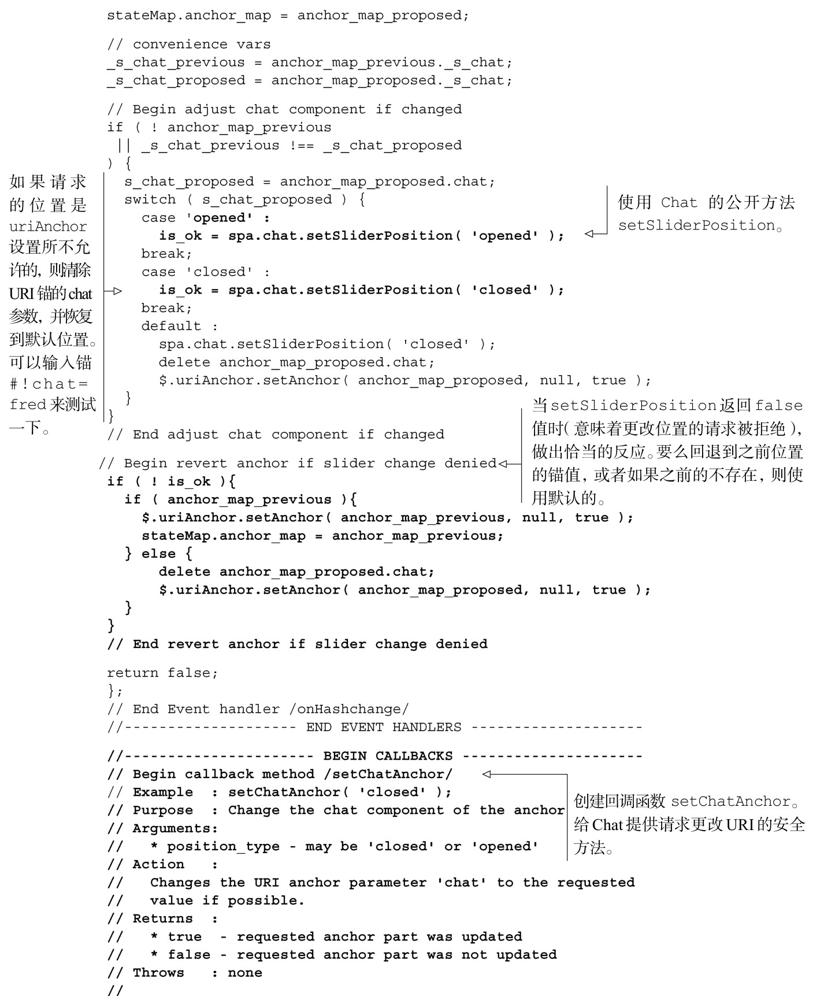
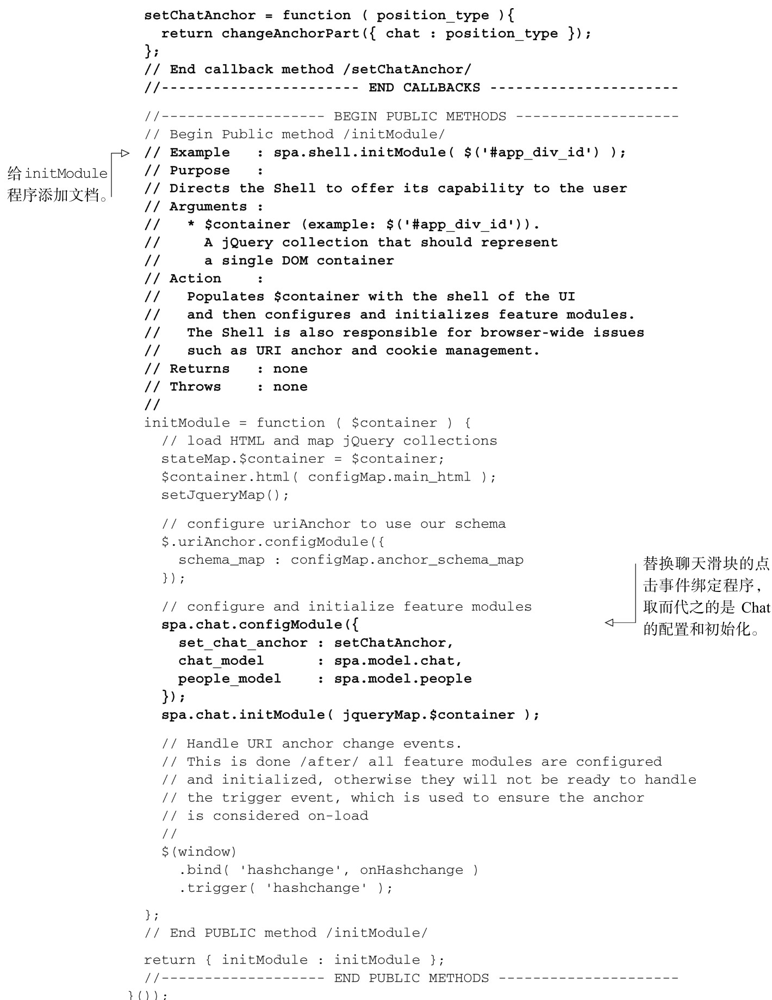
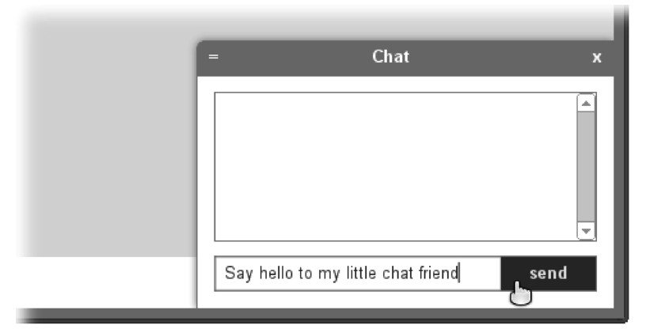

#### 
  4.4.3 清理Shell

现在我们将完成对Shell的更改。下面是我们想要做的事情。

移除聊天滑块的设置和功能，因为这些代码已经移至Chat。

修改onHashchange事件处理程序，如果不能设置请求的滑块位置，则退回到有效的位置。

添加setChatAnchor方法，以便符合先前设计的API。

完善initModule文档。

更新initModule，使用先前设计的API来配置Chat。

我们来修改Shell，如代码清单4-16所示。请注意，我们把早先开发的所有新的API规范直接放到了该文件里面，在实现期间作为指南使用。所有的更改部分以粗体显示。

代码清单4-16 清理Shell——spa/js/spa.shell.js

当打开浏览文档（spa/spa.html）时，应当看到和图 4-13 类似的界面。我们认为这次对聊天滑块的修改是很炫的。它还没有显示消息，我们会在第6章来实现这个功能。

现在代码能很好地工作了，我们来详细地解释一下应用的执行过程，分析一些关键的修改点。

