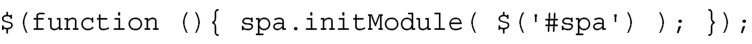
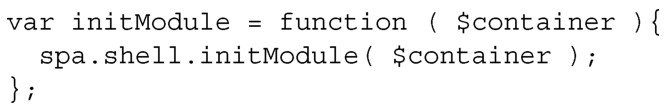
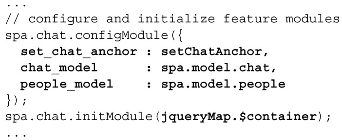
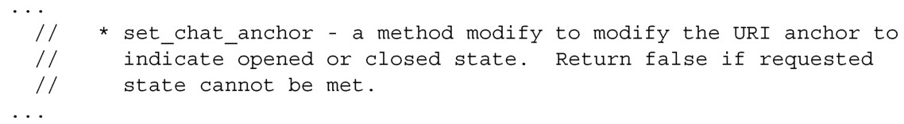
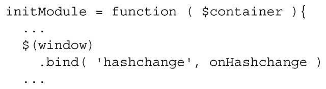
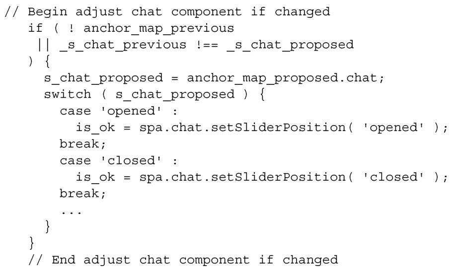

#### 
  4.4.4 详细解释执行的过程

本节关注的是我们在上一节中对应用的修改点。我们先看看应用是如何被配置和初始化的，然后探索当用户点击聊天滑块的时候，发生了什么事情。

当加载浏览文档（spa/spa.html）的时候，一段脚本会初始化根名字空间（spa/js/spa.js），提供一个页面元素（#spa div），供其使用：

然后，根名字空间模块（spa/js/spa.js）会初始化 Shell（spa/js/spa.shell.js），提供一个页面元素（$container），供其使用：

然后，Shell（spa/js/spa.shell.js）会配置和初始化 Chat（spa/js/spa.chat.js）。但是这次的两步操作有点不同。现在的配置满足先前定义的API。set_chat_anchor配置是回调函数，遵循先前创建的规范：

Chat的初始化有点细微不同：Shell提供的容器不是给Chat使用的，而是让Chat把聊天滑块添加到这个容器里面。如果你信任模块作者，这是一个很不错的方式。我们就是这么做的。

当用户点击滑块上的切换按钮时，Chat使用set_chat_anchor回调函数来请求把URI 锚中的 chat 参数更改为 opened 或者 closed，然后返回。仍然由 Shell 来处理hashchange事件，如同在spa/js/spa.shell.js中看到的：

这样当用户点击滑块的时候， hashchange 事件会被 Shell 捕获到，发送给onHashchange事件处理程序。如果URI锚中的chat参数改变了，事件处理程序就会调用spa.chat.setSliderPosition，请求设置成新的位置：

如果位置是有效的，滑块就会移动到被请求的位置，并改变 URI 锚中的 chat 参数。

我们所做的更改，最终的实现符合设定的目标。URI 控制聊天滑块状态，我们也把Chat的所有UI逻辑和代码，移到了新的功能模块。滑块也更加美观，工作得也更好。现在我们来添加一些其他的公开方法，它们在许多功能模块中会经常用到。

