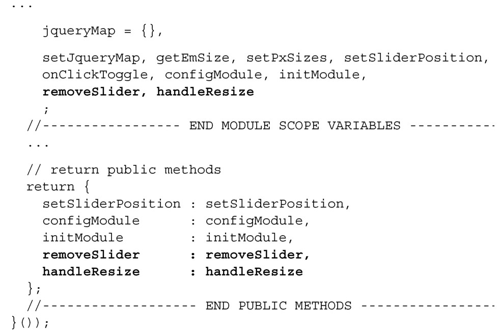

### 
  4.5 添加经常使用的方法

一些公开方法在功能模块中会经常用到，就凭它们的重要程度，是值得讨论一番的。首先是重置方法（removeSlider）；其次是窗口尺寸变化的方法（handleResize）。这俩方法我们都会实现。首先，我们在Chat的模块作用域变量区块的底部声明这些方法名，并在模块的最后，把它们作为公开方法向外导出，如代码清单4-17所示。更改部分以粗体显示。

代码清单4-17 声明方法的函数名——spa/js/spa.chat.js

现在已经声明了方法名，在下个小节我们会实现它们，从移除方法开始。

