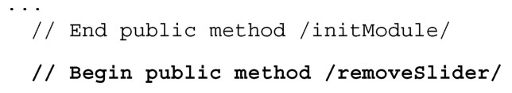
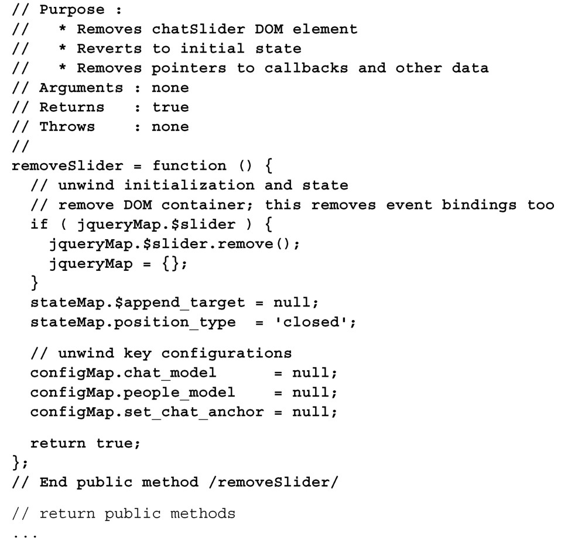
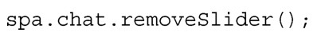
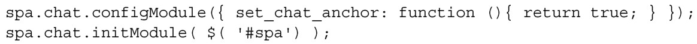

#### 
  4.5.1 removeSlider方法

我们发现许多功能模块都需要一个移除方法。比如，如果实现了认证，我们希望在用户登出的时候，彻底移除聊天滑块。通常，执行这种操作，要么是用来改进性能，要么是为了提高安全性（假设移除方法能很好地删除不再使用的数据）。

这个方法需要删除 Chat 添加的 DOM 容器，依次释放初始化和配置信息。代码清单4-18包含了removeSlider方法的代码。更改部分以粗体显示。

代码清单4-18 removeSlider 方法——spa/js/spa.chat.js

我们不会尝试让任何remove方法过于聪明。它的主要工作就是销毁所有先前的配置和初始化信息，这就是它要做的工作。我们十分谨慎地确保删除了数据指针（data pointer）。这是很重要的，以便数据结构的引用计数降为0，从而让垃圾回收器做它该做的事情。这也是为什么我们总是在模块顶部的configMap和 stateMap中列出所有可能会用到的键的原因，这样就明白需要清理什么了。

可以打开Chrome开发者工具的JavaScript控制台，测试一下removeSlider方法，输入下面的代码（别忘了按下回车键）：

当再看浏览器窗口时，我们看到聊天滑块已经被删除了。下面的代码会复原聊天滑块：

使用JavaScript控制台还原的聊天滑块，功能不完整，因为我们给set_chat_anchor回调函数提供了一个没有意义的函数。在实际使用中，我们总是可以由Shell来恢复Chat模块，在Shell中可以访问必需的回调函数。

这个方法可以用来做很多的事情，像是让滑块优雅地消失，但这留给读者作为练习。现在我们来实现另外一个在功能模块中经常会用到的方法handleResize。

