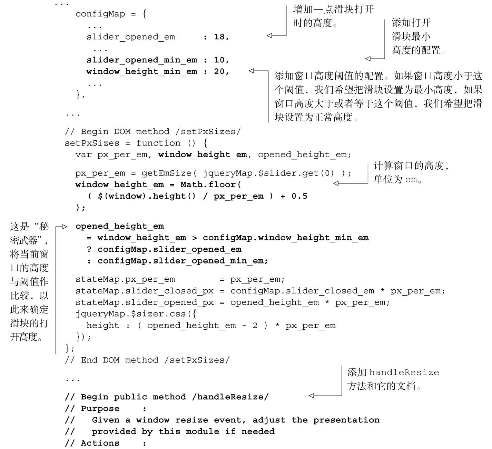
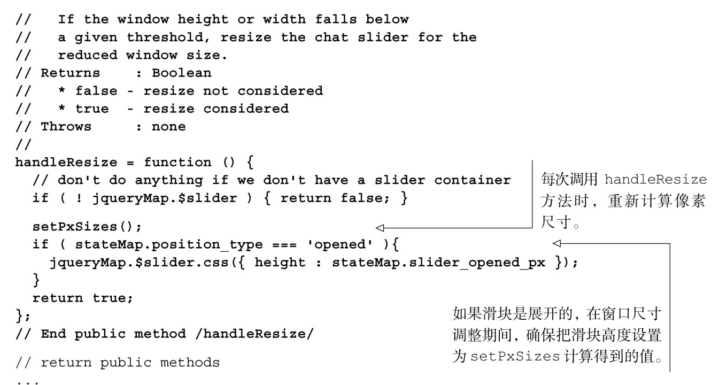
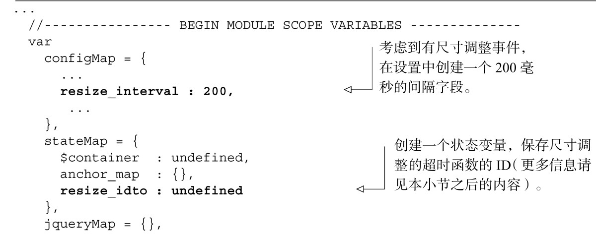
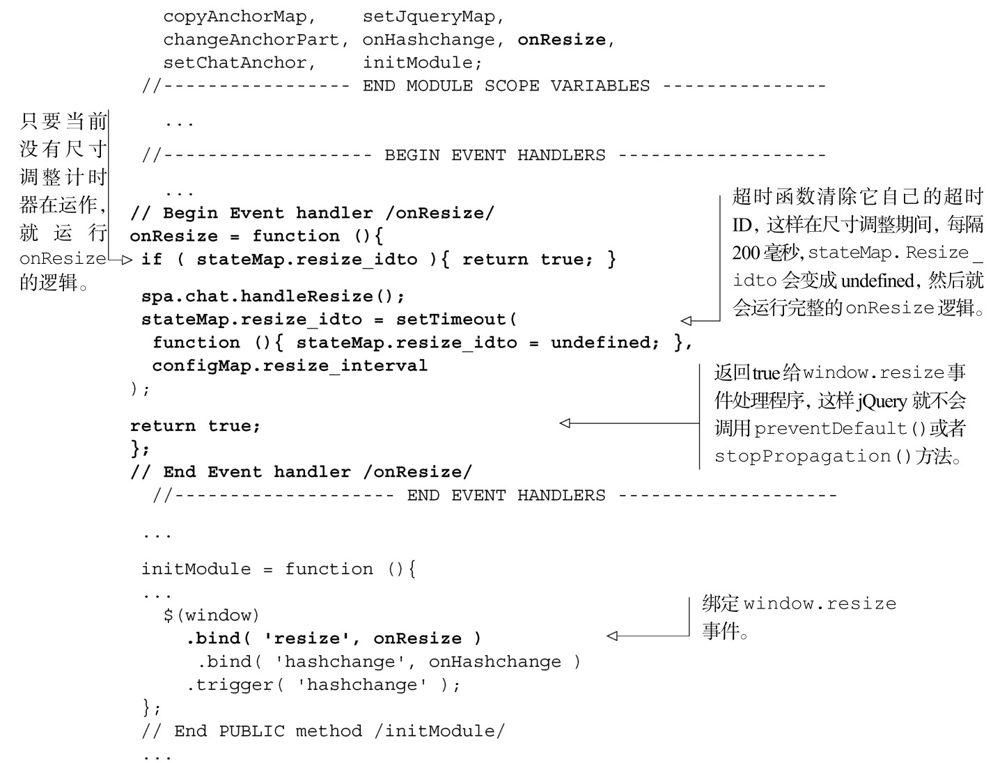
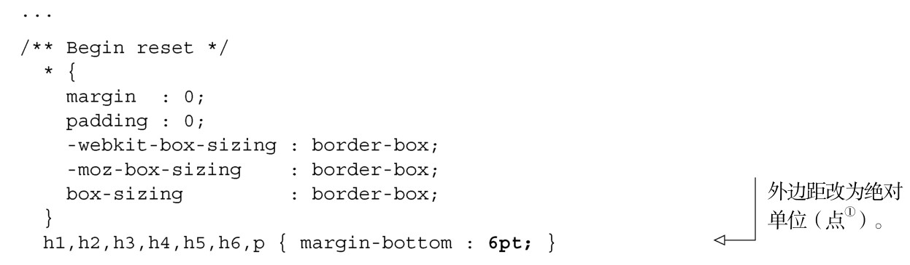
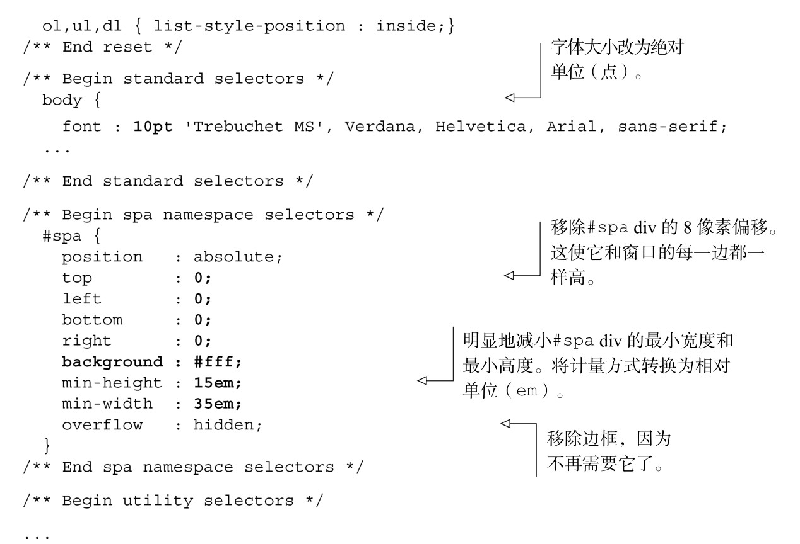

#### 
  4.5.2 handleResize方法

第二个在很多功能模块中常见的方法是handleResize。CSS运用得好的话，单页应用中的大多数内容，在一个合理尺寸的窗口中，都能很好地工作。但也有些情况下它们不能工作，需要一些计算。首先我们来实现handleResize方法，如代码清单4-19所示，然后再来讨论它的用法。更改部分以粗体显示。

代码清单4-19 添加handleResize 方法——spa/js/spa.chat.js

handleResize 事件不会调用它自己。现在我们可能会倾向于给每一个功能模块实现 window.resize 事件处理程序，但这是一个很糟糕的想法。麻烦的是，浏览器触发window.resize 事件的频率很不相同。比如说，我们有五个功能模块，它们都有window.resize 事件处理程序，用户决定调整窗口的尺寸。如果 window.resize 事件每隔10毫秒触发一次，这会导致图形变化十分复杂，很容易使单页应用（还可能是运行单页应用的整个浏览器和操作系统）瘫痪。

一个较好的方法是，让 Shell 的事件处理程序捕获尺寸调整事件，然后再调用所有子模块的 handleResize 方法。这允许我们压制（throttle）尺寸调整的处理并由一个事件处理程序来调度。我们在Shell中来实现这个策略，如代码清单4-20所示。更改部分以粗体显示。

代码清单4-20 添加onResize 事件处理程序——spa/js/spa.shell.js

我们想修改一下样式表，这样就能更好地看到我们的劳动果实。在代码清单4-21中，我们对spa.css进行了修改，减少窗口的最小尺寸，改用相对单位，移除内容周边不需要的边框。更改部分以粗体显示。

代码清单4-21 更改样式以增强onResize 的效果——spa/css/spa.css

①点（point），计量单位，等于1/72 英寸。——译者注

现在可以打开浏览文档（spa/spa.html），观察尺寸调整的事件，增加或者减少浏览器窗口的高度。图4-14对比了在达到阈值之前和之后所显示的滑块。

当然，优化的空间始终都是有的。一种优化方案是让滑块到顶部的边框保持一个最小距离。比如，如果窗口尺寸大于阈值 0.5em，滑块就可以比正常高度短 0.5em。这样可以在调整尺寸期间提供更好的用户体验，有最佳的聊天窗口大小和更平滑的调整效果。实现不难，留给读者作为练习。

