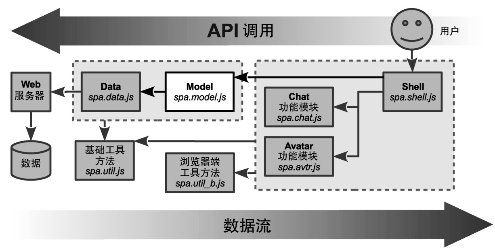

### 
  5.1 理解Model

我们在第3章介绍了Shell模块，它负责应用级的任务，像URI锚管理和应用布局。Shell把特定功能的任务发送给精心隔离的功能模块，我们在第4章已经作了介绍。这些模块有它们自己的视图、控制器和Shell共享给它们的部分模型。架构的概览如图5-1所示<a class="my_markdown" href="['#anchor14']">[14]</a>。

Model把所有的业务逻辑和数据整合到一个名字空间里面。Shell或者功能模块从来都不会直接和 Web 服务器通信，而是和 Model 交互。Model 自身通过使用 Data 模块，从Web服务器分离出来。这种分离对开发人员和质量保证都有好处，正如我们将会看到的。

本章开始讲解Model的开发和使用。在第6章，我们会完成这一工作。我们看一下在这两章过后，将会完成什么工作以及Model需要具备的相应功能。

