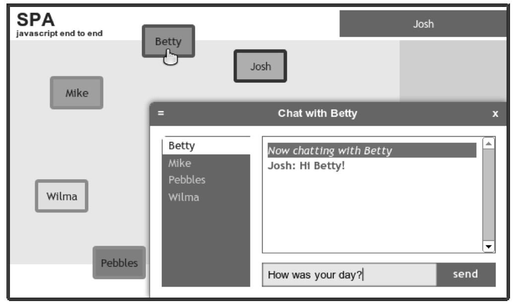

#### 
  5.1.1 我们将要构建什么

在讨论Model之前，参考一个示例应用是很有用的。图5-2演示了在第6章结束的时候，我们打算在单页应用中添加的功能。Shell 会管理登入过程，在图5-2 的右上角能看到登入的用户。Chat 功能模块将管理聊天窗口，它显示在右下角。Avatar 功能模块将管理代表人员的彩色盒子，它们显示在左边。我们来考虑一下每个模块都需要的业务逻辑和数据。

为了管理登入和登出的过程，Shell需要知道当前用户。它需要确定“当前用户是谁”的方法，在需要时更改用户。

Chat功能模块也需要查看当前用户（比如这个示例中的Josh），以此判断他是否已授权发送或者接收消息。它需要确定正在和用户聊天的人，如果有的话。它需要查询在线人员的列表，这样就可以把他们显示在聊天滑块的左边。最后，它需要发送消息和选择用户进行聊天的方法。

Avatar功能模块也需要查看当前用户（Josh），以此判断他是否已授权查看头像并与之交互。它也需要当前用户的身份证明，这样它就能把当前用户的头像显示为蓝色。它也需要确定正在和用户聊天的人（Betty），这样它就能把这个人的头像显示为绿色。最后，它需要设置和检索当前所有在线人员头像的详细信息（比如颜色和位置）的方法。

模块很多必需的业务逻辑和数据都是重叠的。比如，我们知道Shell需要知道当前用户对象，Chat和Avatar模块同样也需要。我们也知道需要为Chat和Ava tar提供在线用户名册。我们想到了一些策略，如何设法管理这种重叠。

在每个功能模块中构建必需的逻辑和数据。

在不同的功能模块中构建部分逻辑和数据。比如，把Chat当作people对象的拥有者，Avatar是chat对象的拥有者。然后在模块之间互相调用，以便共享信息。

构建中央Model，合并逻辑和数据。

第一个选择很有趣，在不同的模块中维护并行的数据和方法，这容易产生错误，是劳动密集型的做法。如果这么做，我们宁愿去找一份激动人心的卖汉堡包的工作。是的，我喜欢那里的炸薯条。

第二个选择的效果好一点，不过是暂时的。一旦逻辑和数据达到了适度水平的复杂度，跨模块依赖的数量，会产生可怕的“混乱不堪”的代码。

第三个选择是使用Model，根据我们的经验，这是目前为止最好的选择，也有不会马上体现出来的好处。我们来看一下精心编写的Model应该做什么工作。

