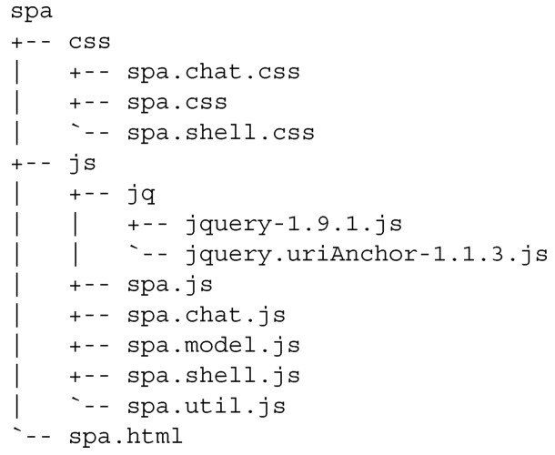
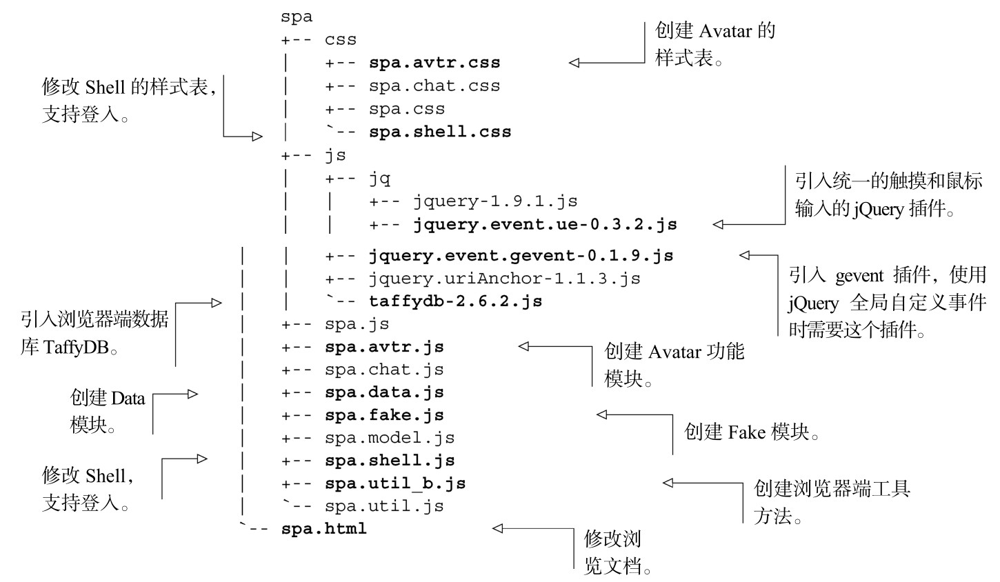

#### 
  5.2.1 规划文件结构

建议你把第4章的整个目录结构复制到一个新的“chapter_5”目录里面，这样就可以在新目录里面更新文件了。我们来回顾一下第4章留下的文件结构，如代码清单5-1所示。

代码清单5-1 第4章的文件结构

下面是我们计划要做的修改。

创建Avatar的CSS样式表。

修改Shell的CSS样式表，支持用户登入。

引入统一的触摸和鼠标输入的jQuery插件。

引入全局自定义事件的jQuery插件。

引入浏览器端数据库的JavaScript库。

创建Avatar模块。这是给第6章用的占位符。

创建Data模块。它会提供从服务器获取“真实”数据的接口。

创建Fake模块。它会提供用于测试的“伪造”数据的接口。

创建浏览器端工具方法模块，这样就可以共享需要浏览器环境的通用程序。

修改Shell模块，以便支持用户登入。

修改浏览文档，引入新的CSS和JavaScript文件。

更新后的文件和目录看起来应该和代码清单5-2一样。所有要创建或者修改的文件以粗体显示。

代码清单5-2 更新后的文件结构

现在已经确定了想要添加或者修改的文件，打开可信赖的文本编辑器，我们来完成这些工作。事实证明，按上面的展示顺序来考虑每个文件是最好的。如果你正在运行示例，可以在实现的过程中创建这些文件。

