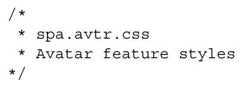
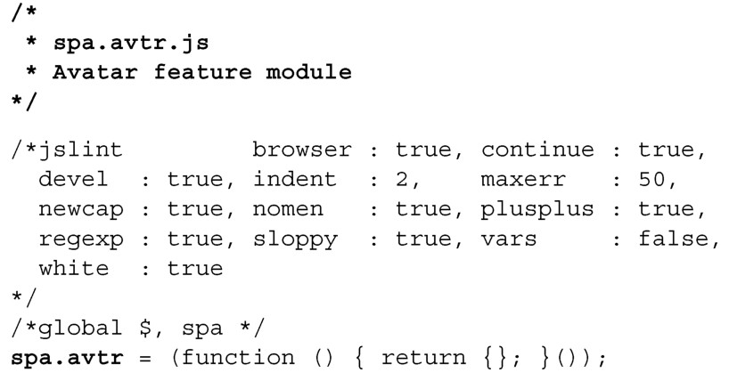
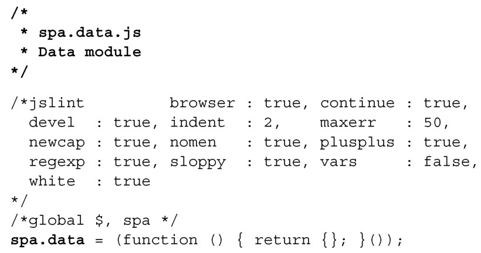
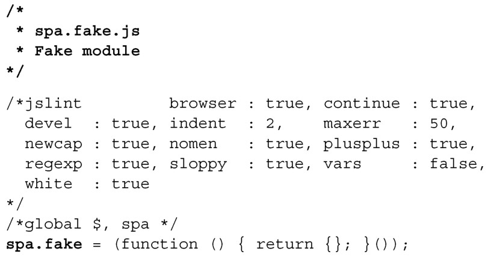
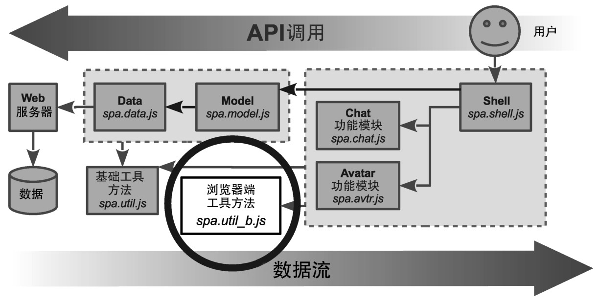
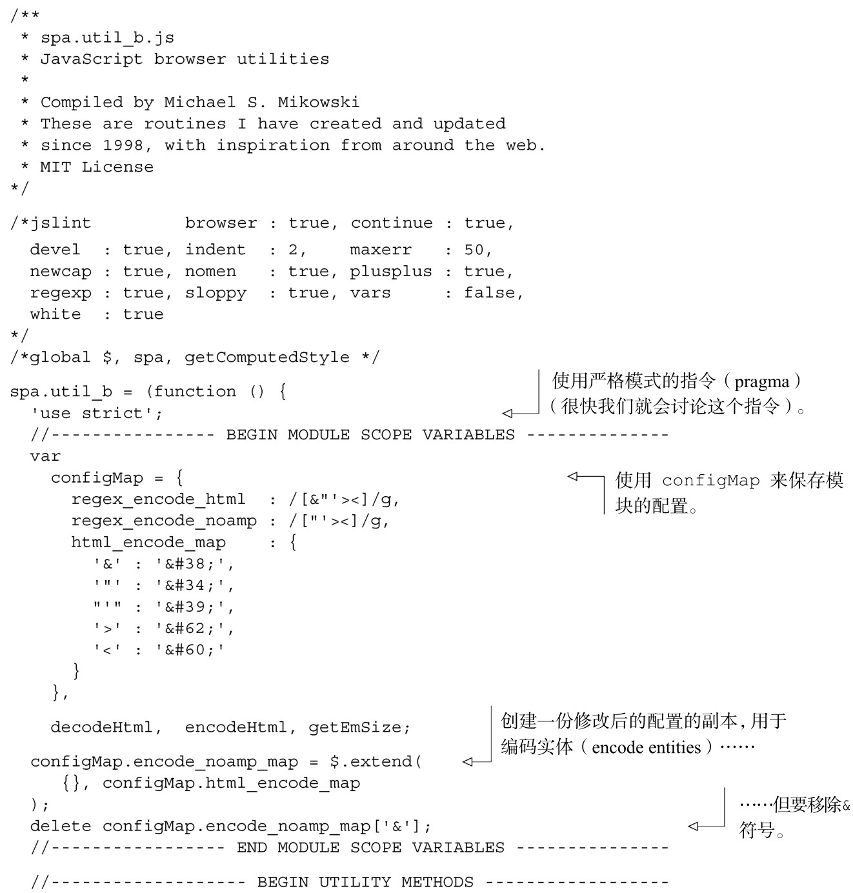
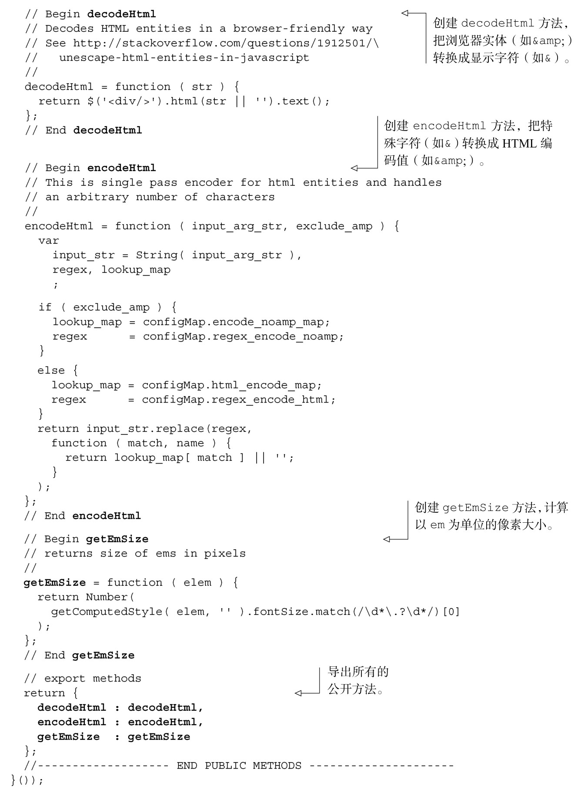
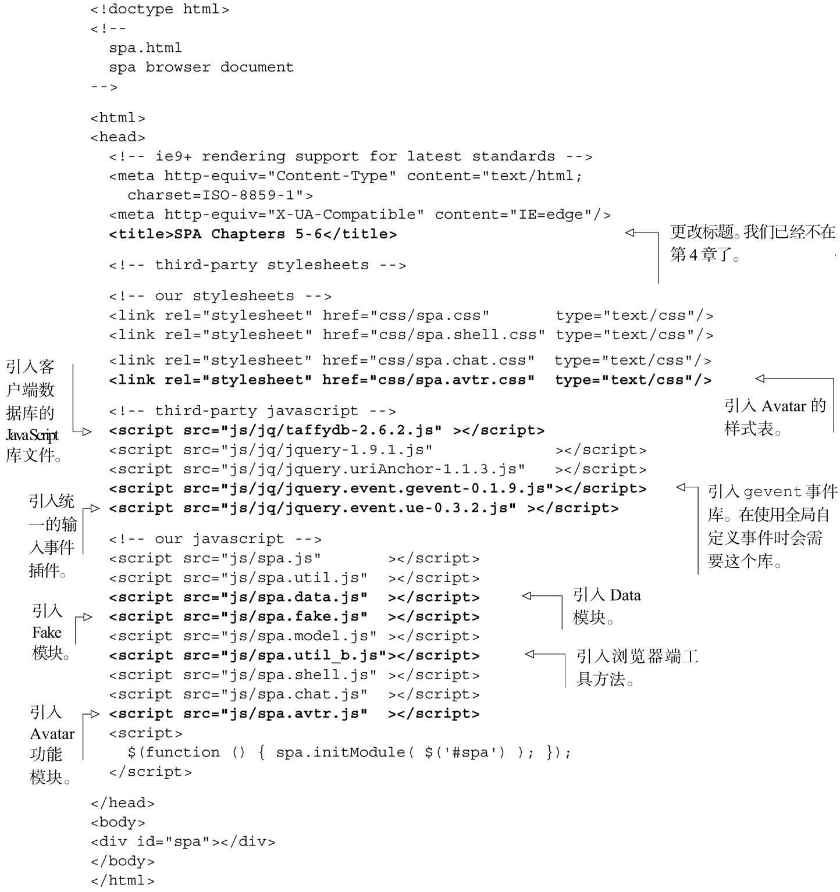

#### 
  5.2.2 填充文件

我们要考虑的第一个文件是spa/css/spa.avtr.css。我们将创建这个文件，并填写如代码清单5-3所示的内容。最初它是一个桩文件（stub）。

代码清单5-3 Avatar 样式表（桩文件）——spa/css/spa.avtr.css

下面是3个库文件。我们把它们下载到spa/js/jq目录里面。

可以在https://github.com/mmikowski/jquery.event.ue获取文件spa/js/jq/jquery.event. ue-0.3.2.js。它提供了统一的触摸和鼠标输入。

可以在https://github.com/mmikowski/jquery.event.gevent获取文件spa/js/jq/jquery. event.gevent-0.1.9.js，使用全局自定义事件时需要这个文件。

文件spa/js/jq/taffydb-2.6.2.js提供了客户端数据库。可以在https://github.com/typicaljoe/taffydb获取这个文件。它不是jQuery插件，如果我们开发的是一个大型工程，可以把它放到单独的spa/js/lib目录里面。

接下来的3个JavaScript文件（spa/js/spa.avtr.js、spa/js/spa.data.js和spa/js/spa.fake.js）都是桩文件。它们的内容如代码清单5-4、代码清单5-5和代码清单5-6所示。它们几乎是一样的，每个文件都有一个头部，接着是JSLint选项，然后是和文件名一致的名字空间的声明。不同的部分以粗体显示。

代码清单5-4 创建Avatar 功能模块——spa/js/spa.avtr.js

代码清单5-5 创建Data 模块——spa/js/spa.data.js

代码清单5-6 创建Fake 数据模块——spa/js/spa.fake.js

请回忆一下/*jslint…*/和/*global…*/区块的内容，在运行JSLint来检查代码是否包含常见错误时会用到。/*jslint…*/区块设置验证偏好。比如，browser:true告诉JSLint验证程序，假定这段JavaScript代码是在浏览器中运行的，因此会有document对象（除了别的对象之外）。/*global…*/区块告诉JSLint验证程序，变量$和spa已经在模块外定义。没有这些信息的话，验证程序会报告这些变量在使用之前没有定义。请查看附录A关于JSLint设置的完整讨论。

接下来，可以添加浏览器端工具方法文件 spa/js/spa.util_b.js。这个模块提供的是通用程序，只在浏览器环境中可以工作。也就是说，浏览器端工具方法在 Node.js 中不能正常工作，而标准的工具方法（spa/js/spa.util.js）是可以的。图5-3演示了架构中的这个模块。

浏览器端工具方法模块会提供encodeHtml和decodeHtml工具方法，如你所料，它们可以用来编码和解码HTML中的特殊字符，比如&和<<a class="my_markdown" href="['#anchor15']">[15]</a>。它也提供了getEmSize工具方法，可以计算浏览器中以em为单位的像素数值。共享这些工具方法，可以确保它们的实现是一致的，也使得需要编写的代码量是最小的。打开文本编辑器，创建代码清单5-7所示的文件。方法以粗体显示。

代码清单5-7 创建浏览器端工具方法模块——spa/js/spa.util_b.js

最后要考虑的文件是浏览文档。我们将更新这个文件，使用新的CSS和JavaScript文件，如代码清单5-8所示。以第4章的文档为基准，更改部分以粗体显示。

代码清单5-8 更新浏览文档——spa/spa.html

现在一切已经准备就绪，我们来讨论一下在单页应用中添加触摸控件的问题。

