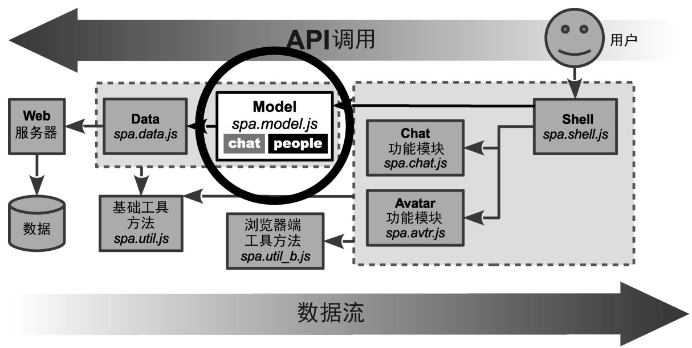

### 
  5.3 设计people对象

本章我们将构建Model中的people对象，如图5-4所示。

我们期望 Model 分成两部分：一个 chat 对象和一个 people 对象。下面是在第 4章中简述的规范：

people对象的描述信息（“an object that provides methods to interact with the list of people the Model maintains”<a class="my_markdown" href="['#anchor16']">[16]</a>）是个不错的切入点，但对实现没有足够详细的说明。我们先从设计people对象中用来表示人员列表中的人的对象入手。

