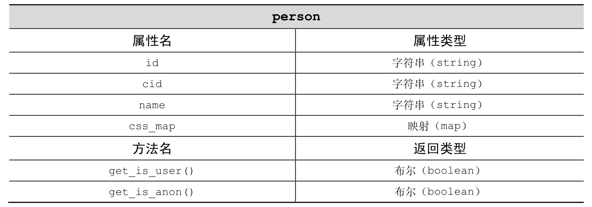
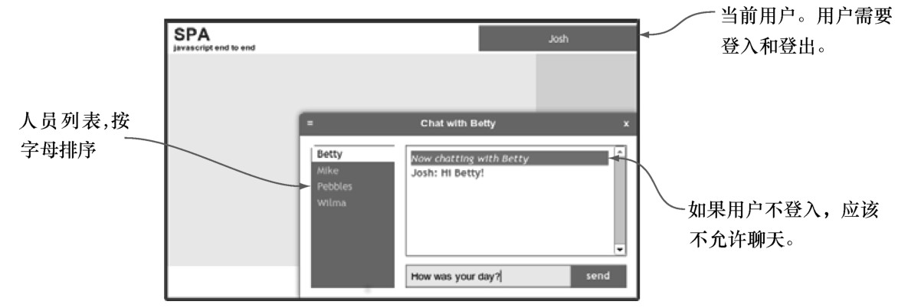

#### 
  5.3.1 设计person对象

我们已经决定，people对象应该管理一批person<a class="my_markdown" href="['#anchor17']">[17]</a>。经验表明，person能很好地用对象来表示。因此，一个people对象将管理很多person对象。我们认为每个person对象最少需要以下属性。

id——服务端ID。所有发送自后端的对象都会定义这个属性。

cid——客户端ID。应该总是定义这个属性，通常和id相同，但如果在客户端创建了一个新的person对象并且还没有更新后端，则服务端ID是未定义的。

name——person的名字。

css_map——显示属性的映射。头像功能需要这个属性。

person对象的UML类图如表5-1所示。

没有客户端ID属性

如今，很少使用单独的客户端ID属性。我们使用单个ID属性和唯一的前缀来表示由客户端生成的ID。比如，客户端的ID可能是x23，而源自后端的ID可能是50a04142c692d1fd18000003（特别是在用MongoDB的时候）。由于后端生成的ID永远不会是以x开头，这就很容易地能判断ID是在哪边生成的。绝大多数的应用逻辑不需要担心ID源自哪边。只有在把数据同步到后端时，才会变得重要。

在考虑person对象应该有什么方法之前，先考虑一下people对象需要管理的person的类型。图5-5演示了想让用户看到的实体模型（mockup），有些关于people的说明。

看来people对象需要识别4种类型的person：

（1）当前用户person；

（2）匿名的person；

（3）正在和用户聊天的person；

（4）其他在线的person。

目前我们只关心“当前用户person”和“匿名的person”，“在线的person”在下一章会讨论。我们需要能帮助识别这些类型用户的方法。

get_is_user()——如果person对象是当前用户，则返回true。

get_is_anon()——如果person对象是匿名的，则返回true。

现在已经详细说明了person对象，我们来考虑一下people对象是如何来管理它们的。

