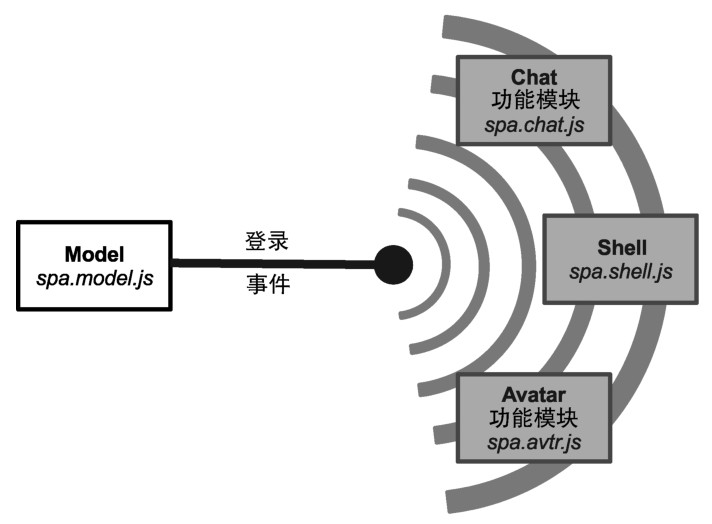
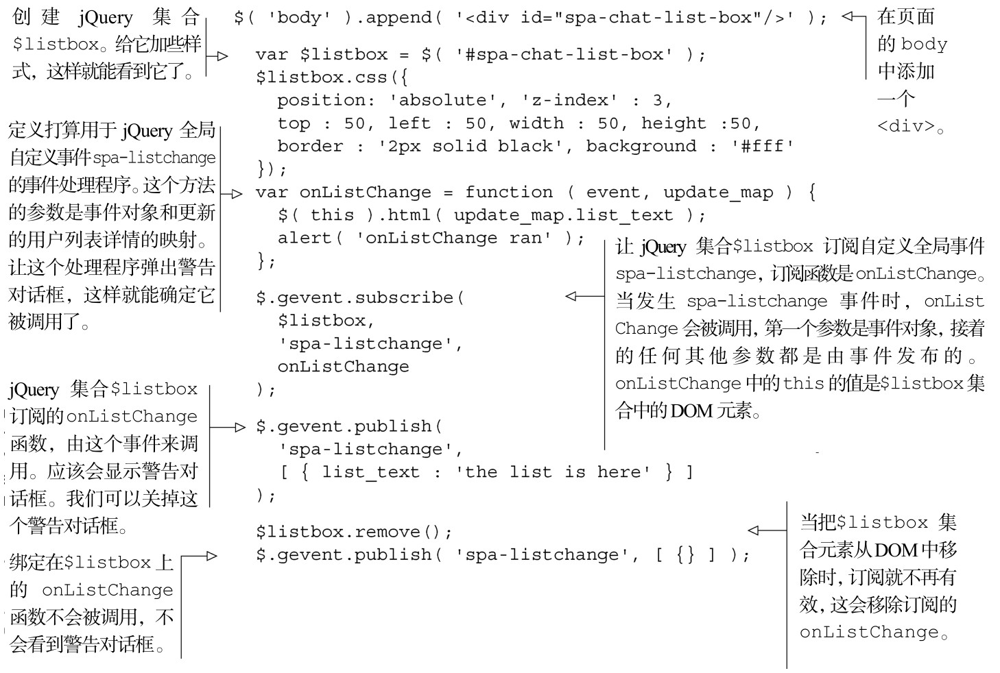

#### 
  5.3.2 设计people对象的API

people对象的API，由方法和jQuery全局自定义事件组成。我们先考虑方法调用。

1．设计people的方法调用

我们希望Model总是有可用的当前用户对象。如果某个人没有登入，用户对象应该是匿名的 person 对象。当然，这意味着应该向 person 提供登入和登出的方法。聊天滑块的左侧人员列表，表明我们想要维护一份在线人员的列表，可以和他们聊天，后端按字母顺序返回。考虑到这些需求，下面的方法清单看来是对的：

get_user()——返回当前用户person对象。如果当前用户没有登入，则返回匿名person对象。

get_db()——获取所有person对象的集合，包括当前用户。我们想要的人员列表始终是按字母顺序排列的。

get_by_cid(<client_id>)——获取有唯一客户端ID的person对象。尽管可以通过“获取集合然后根据客户端ID查找这个person对象”来完成相同的功能，但我们希望这种频繁使用的功能有专用方法，有助于避免错误和提供优化的机会。

login(<user_name>)——以指定用户名的方式登入用户。我们会避免复杂的登入认证，这已超出了本书的范围，别的地方有很多示例。当用户登入的时候，为体现新的用户身份，应该改变当前用户对象。我们也应该发布一个叫做spa-login的事件，携带的数据是当前用户对象。

logout()——将当前用户对象恢复为匿名的person。我们应该发布一个叫做spa-logout的事件，携带的数据是登出之前的用户对象。

login()和 logout()两个方法的描述说明，发布事件是它们响应的一部分。下一小节会讨论这些是什么事件以及为什么要使用这些事件。

2．设计people的事件

我们使用事件来异步发送数据。比如，如果人员列表变化了，Model可能会想发布一个spa-listchange事件，分享更新后的人员列表数据 <a class="my_markdown" href="['#anchor18']">[18]</a>。功能模块或者Shell中的对这一事件感兴趣的方法，为能接收到这事件，需要注册Model的事件，这通常叫做订阅事件。当发生spa-listchange事件时，订阅方法会被通知到，并接收由Model发出来的数据。比如，在Avatar中有一个添加新头像的方法，在Chat中有一个在聊天滑块中添加人员列表的方法。图5-6演示了事件是如何广播给订阅的功能模块和Shell的。

我们想让Model至少发布两种类型的事件，作为people对象API的一部分<a class="my_markdown" href="['#anchor19']">[19]</a>。

spa-login：在完成登入时发布这个事件。这不会立刻发生，因为登入过程经常需要到后端走个来回。事件携带的数据是更新后的当前用户对象。

spa-logout：在完成登出时发布这个事件。事件携带的数据是登出之前的用户对象。

事件通常是一种更可取的异步分发数据的方式。经典的JavaScript实现使用回调函数，这导致代码变得一团乱麻，调试和保持模块化都很困难。事件允许模块代码保持独立，却仍然使用相同的数据。为此，当从Model异步分发数据时，我们坚定地喜欢事件的方式。

因为已经使用了jQuery，所以使用jQuery的全局自定义事件作为分发机制是明智的选择。我们已经创建了全局自定义事件插件来提供这个功能 <a class="my_markdown" href="['#anchor20']">[20]</a>。jQuery全局自定义事件，表现优异，和其他jQuery事件有相同的、熟悉的接口。任意jQuery集合都可以订阅特定的全局自定义事件，并在事件发生时调用某个函数。事件通常携带着数据。比如，spa-login事件，可能传递了新近更新的用户对象。当把某个元素从文档中移除时，该元素所有订阅的函数会自动移除。代码清单5-9演示了这些概念。我们可以打开浏览文档（spa/spa.html），打开JavaScript控制台测试一下。

代码清单5-9 jQuery 全局自定义事件的用法

如果你对 jQuery 全局自定义事件处理已经得心应手了，那这可能是老生常谈，但这也是好事。如果不是，也不要太担心。就认为它的行为和其他所有的 jQuery 事件是一致的。它也很强大，经过非常细致的测试，利用了 jQuery 内部方法所使用的相同代码。当可以只使用一种事件机制的时候，为什么还要学习两种呢？上面讲述的就是“使用jQuery全局自定义事件”强有力的理由，也是“反对使用会引入冗余的和有细微差异的事件机制的框架库”强有力的理由。

