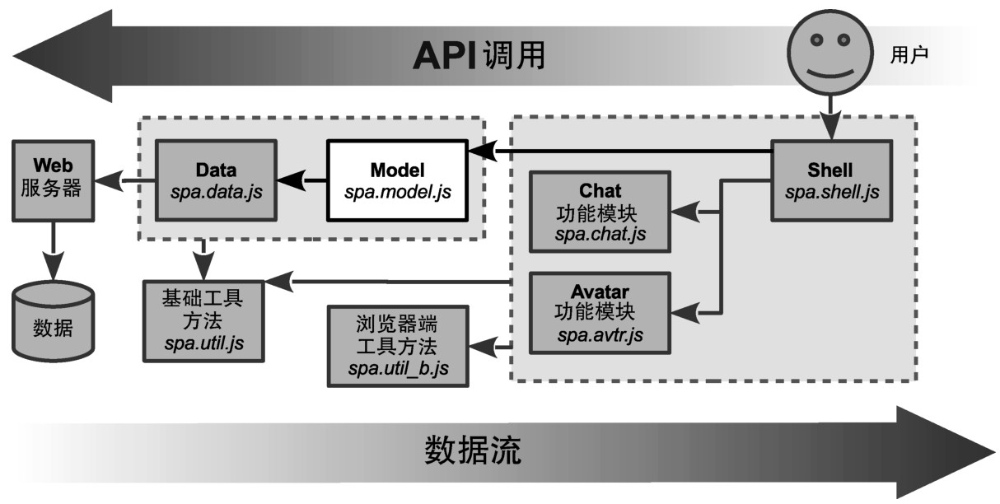
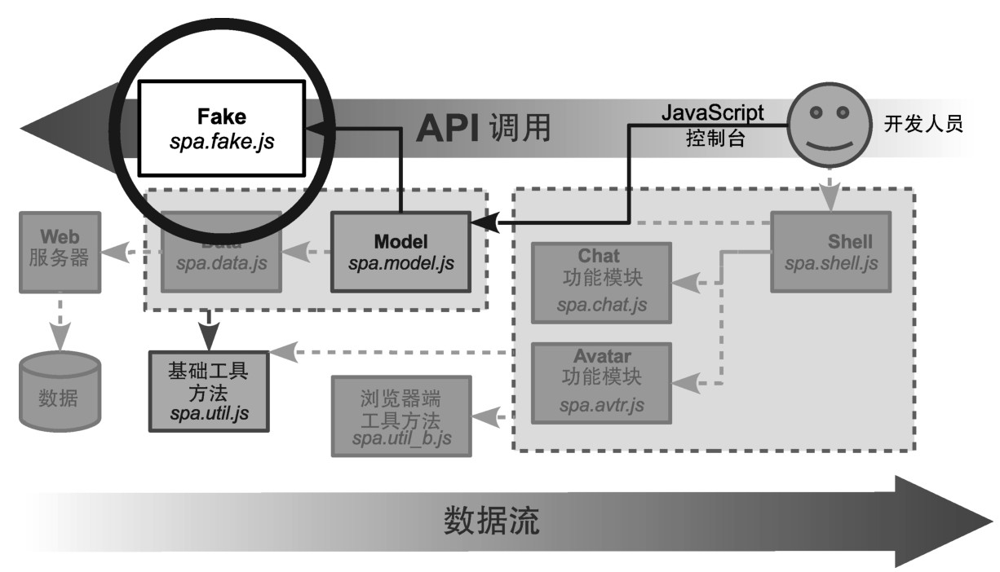
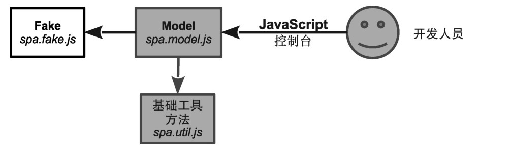

### 
  5.4 构建people对象

现在已经设计了people对象，我们可以来构建它。我们将使用Fake模块来向Model提供伪造数据。这允许在没有服务器或者功能模块的情况下，也能继续前行。Fake 是快速开发的关键所在，在完成目标之前，就一直使用伪造数据。

再来回顾一下我们的架构，看一下 Fake 是如何帮助改进开发的。架构的完整实现如图5-7所示。

嗯，这很不错，但无法经过一轮处理就能取得成功。我们宁愿在不需要 Web 服务器或者UI的情况下进行开发。在这个阶段，我们想专注于Model，不想被其他模块搞得心烦意乱。可以使用Fake模块来模拟Data和服务器连接，可以使用JavaScript控制台直接调用API，而不是使用浏览器窗口。图5-8演示了当采用这种方式来进行开发的时候，我们需要的模块是什么。

清除所有没用到的代码，如图5-9所示，看看剩下的模块是什么。

通过使用Fake和JavaScript控制台，可以只专注Model的开发和测试。这对于和Model一样重要的模块来说，尤其有利。随着讲解的不断深入，要记住，这一章中的“后端”是由Fake模块模拟的。现在已经概述了开发策略，我们来实现Fake模块。

