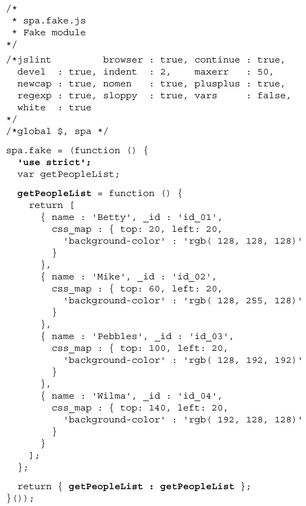

#### 
  5.4.1 创建伪造的人员列表

我们所说的“真实”数据，通常指的是 Web 服务器发送给浏览器的数据。但是如果我们已经很疲倦了并且已经工作了一整天，不想在“真实”数据上花费更多的精力，怎么办？没关系，有时候可以伪造数据。在本小节，我们会坦率并真诚地讨论如何伪造数据。希望我们能回答所有你曾经想知道却不敢问的关于伪造数据的问题。

在开发期间，我们使用一个叫做 Fake 的模块，向应用提供模拟的数据和方法。我们会在Model中设置isFakeData标志，指示应用使用Fake模块的数据和方法，而不是使用“真实”的Web服务器数据和Data模块的方法。这就能脱离服务器而快速专注地进行开发。由于已经在概述“person对象的行为”方面做了很充分的工作，伪造数据就相当容易了。首先，我们会创建一个方法，返回一批伪造人员的数据。打开文本编辑器，创建spa.fake.getPeopleList方法，如代码清单5-11所示。

代码清单5-11 向Fake 添加模拟的用户列表——spa/js/spa.fake.js

在该模块中，引入了粗体显示的'use strict'指令（pragma）。如果你认真对待大规模JavaScript项目（我们知道你是的），我们鼓励你考虑在函数作用域的名字空间内使用严格指令。当使用严格模式的时候，在JavaScript执行不安全的操作时，就很可能会抛出异常，比如使用了未定义的全局变量。这也会禁用令人困惑的和未经充分考虑的特性。尽管很诱人，但不要在全局作用域中使用严格指令，因为它会破坏其他的 JavaScript，有少数第三方开发者不会像你一样与时俱进。下面在Model中使用这个伪造的人员列表。

