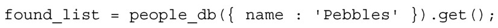
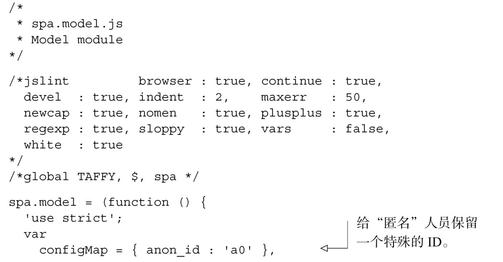
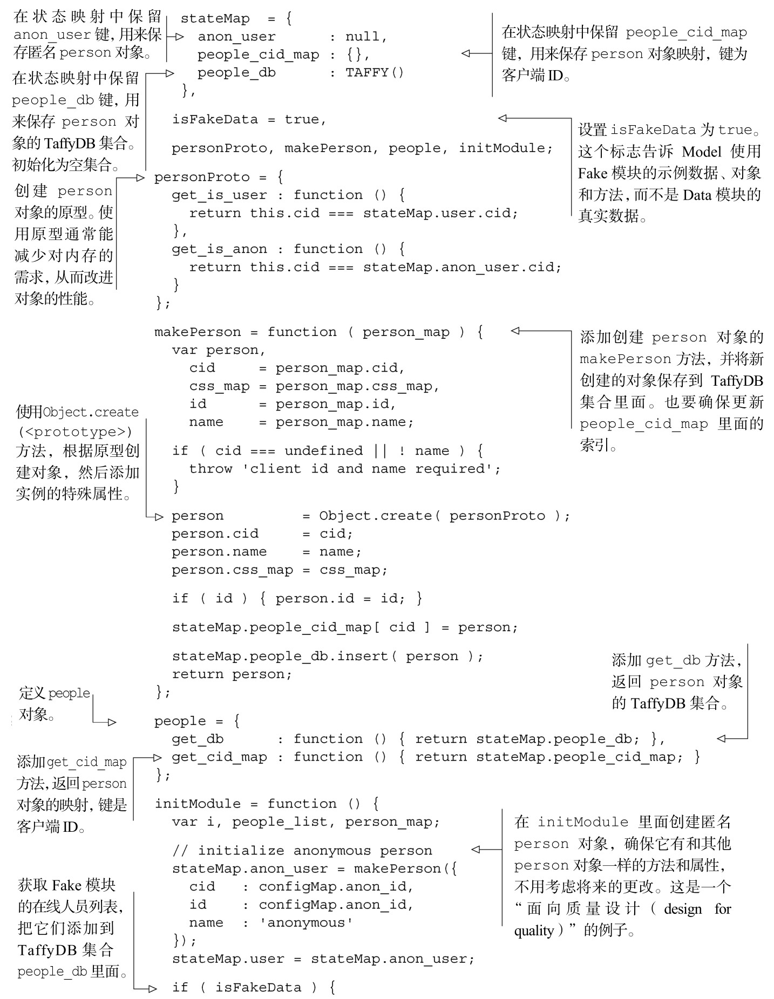
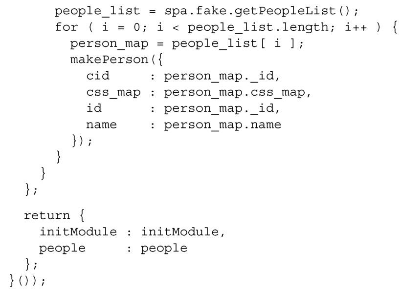
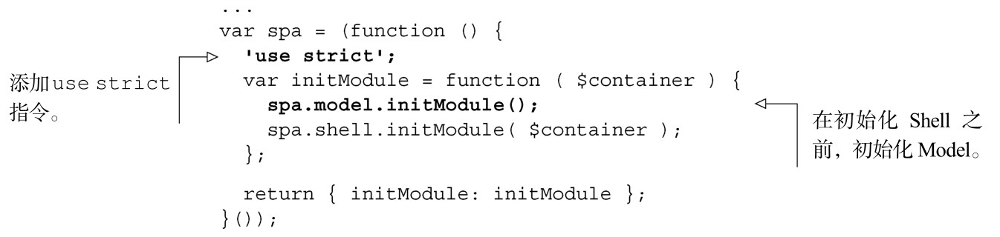
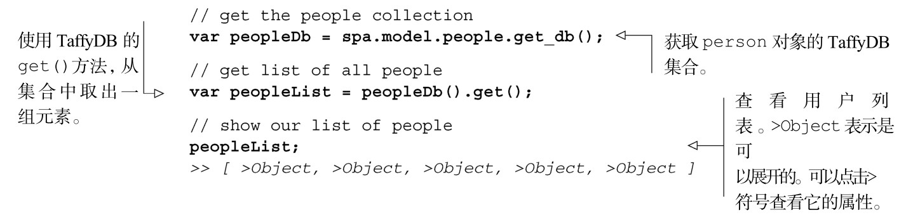
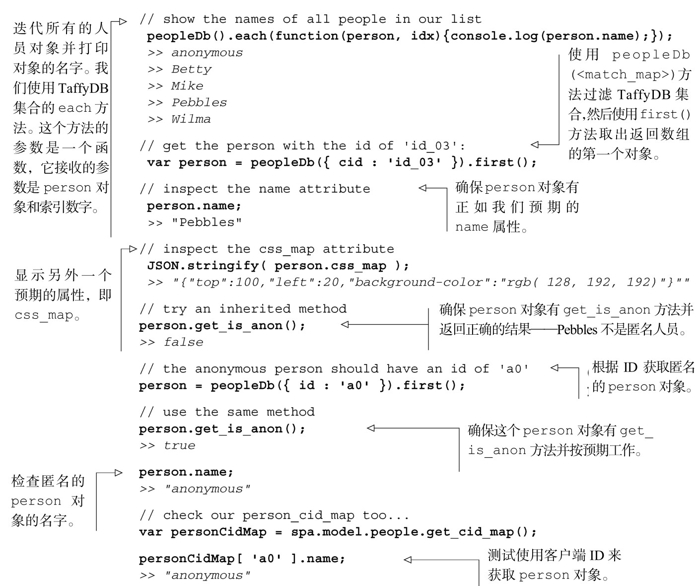

#### 
  5.4.2 开始构建people对象

现在开始构建 Model 中的 people 对象。当它被初始化的时候（使用spa.model.initModule()方法），我们首先使用 makePerson 构造函数（创建其他person对象，用的也是这个构造函数）来创建匿名的person对象。这就确保了该对象和其他person对象有相同的方法和属性，而不用管将来对该构造函数的更改。

接着，使用由spa.fake.getPeopleList()提供的伪造人员列表，来创建person对象的TaffyDB集合。TaffyDB是一种为在浏览器中使用而设计的JavaScript数据存储。它提供了很多数据库风格的功能，像通过匹配属性来选择一组对象。比如，如果有一个person对象的TaffyDB集合，名字为people_db，可以像下面这样选择名字为“Pebbles”的一组人员：

为什么我们喜欢TaffyDB？

我们喜欢 TaffyDB，是因为它专注于提供在浏览器中管理富数据（rich data）的功能，并且它不会做其他事情（像引入细微差异的事件模型，这对于jQuery来说是多余的）。我们喜欢使用像TaffyDB这种优秀并专注的工具。由于某种原因，如果需要不同的管理数据的功能，可以使用其他工具来替换（或者自己编写一个），而不用重构整个应用。请到 http://www.taffydb.com/查看这个简便工具的完整文档。

最后，导出people对象，这样就可以测试API了。这次将提供和person对象交互的两个方法：spa.model.people.get_db()返回TaffyDB的人员集合，spa.model.people.get_cid_ map()返回键为客户端ID的映射。打开值得信赖的文本编辑器，开始构建Model，如代码清单5-12所示。这只是第一轮，所以不要觉得必须懂得所有的东西。

代码清单5-12 开始构建Model——spa/js/spa.model.js

当然，还没有什么会调用 spa.model.initModule()。我们来修改一下代码，更新根名字空间模块spa/js/spa.js，如代码清单5-13所示。

代码清单5-13 在根名字空间模块中添加Model 的初始化代码——spa/js/spa.js

现在加载浏览文档（spa/spa.html），确保页面和之前一样（如果不一样或者在控制台之中有错误，那是有什么搞错了，应该追溯一下原因）。尽管看起来一样，但是底层代码的工作方式不同了。打开Chrome开发者工具的JavaScript控制台，测试一下people的API。我们可以获取人员集合，并探索一些TaffyDB的好处，如代码清单5-14所示。输入以粗体显示，输出以斜体显示。

代码清单5-14 测试伪造人员对象，并喜欢上这种方式

上面的测试表明已经成功地构建了people对象的部分内容。在下一小节，我们将完成这项工作。

