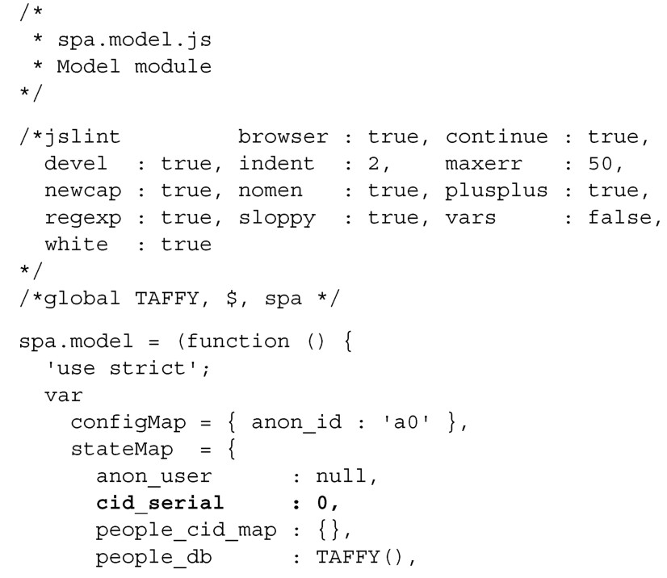
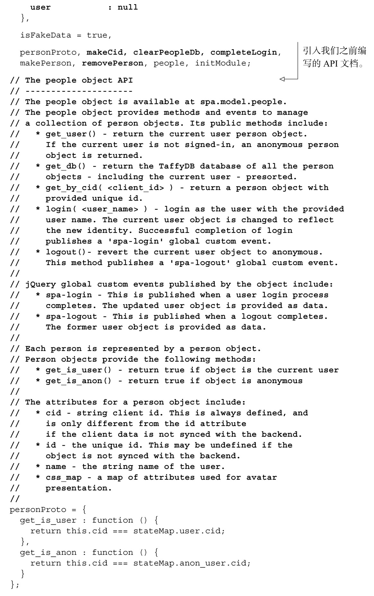
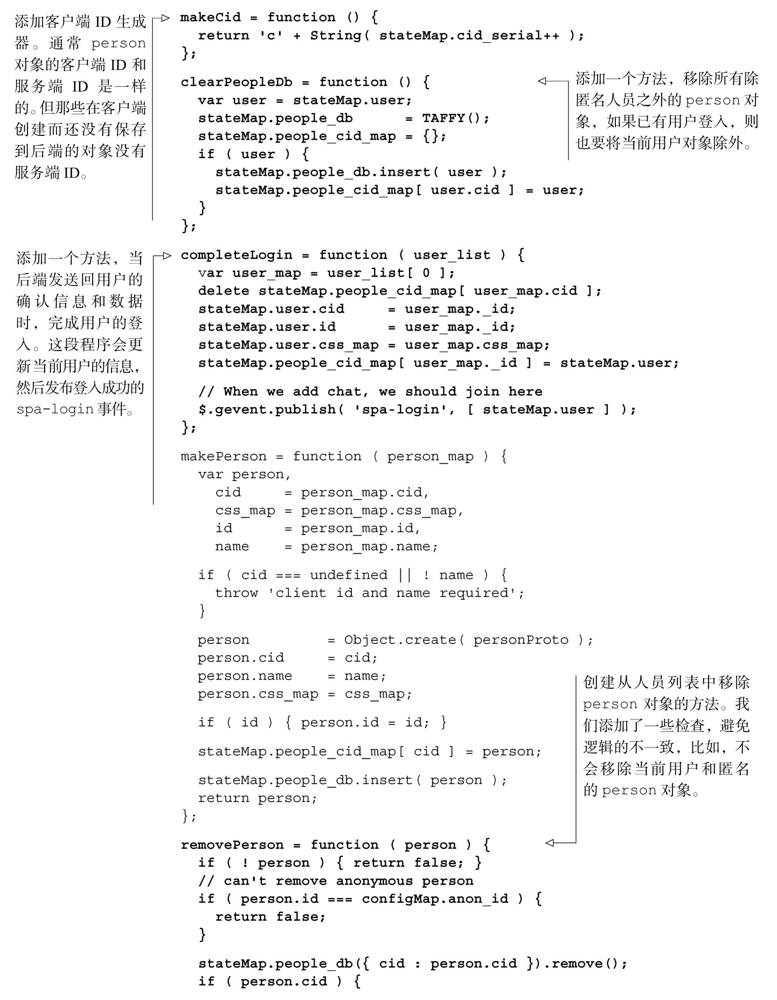
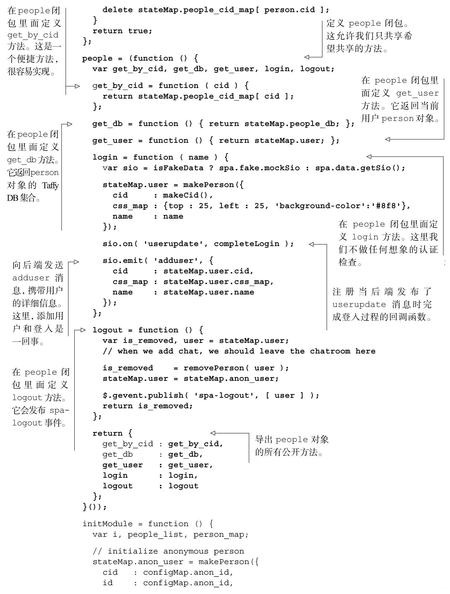
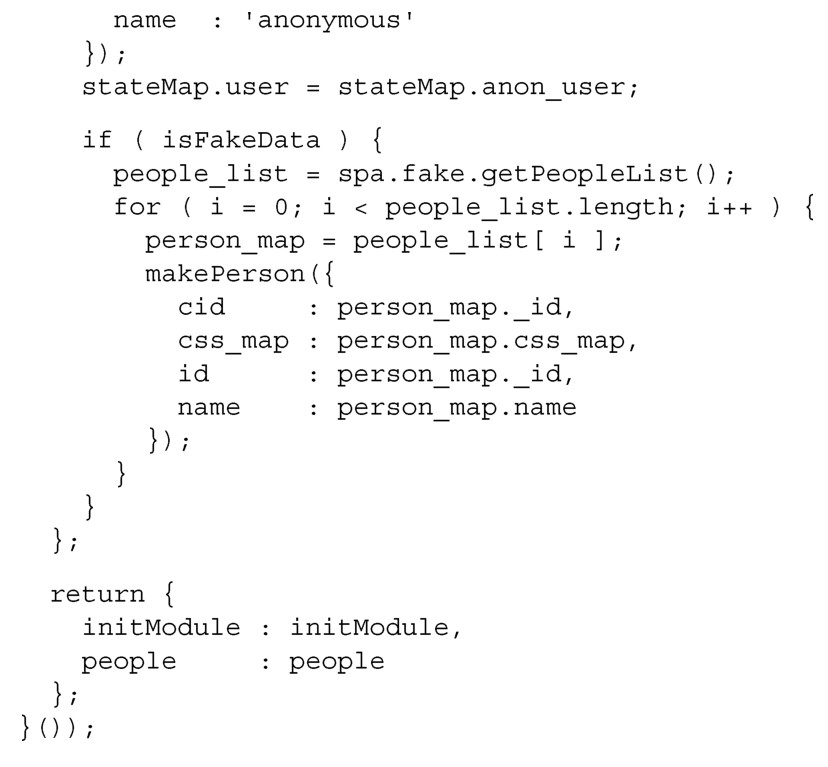
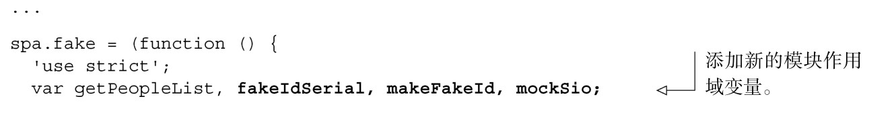
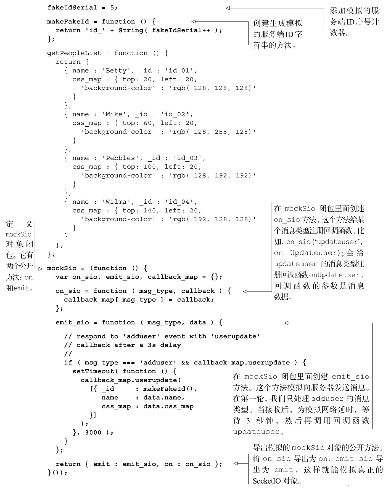
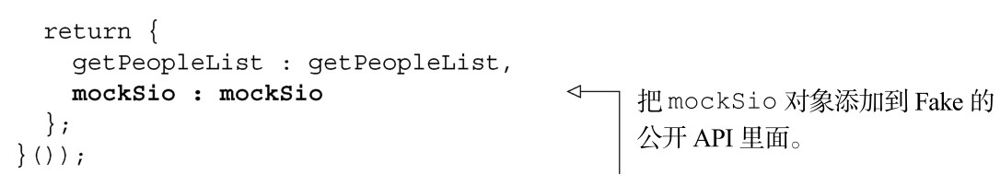

#### 
  5.4.3 完成people对象的构建

为了确保people对象的API符合之前制定的规范，需要更新Model和Fake模块。先来更新Model。

1．更新Model

我们希望people对象能完全支持user的概念。考虑一下需要添加的新方法。

login(<user_name>)，会启动登入的过程。需要创建一个新的person对象，并把它添加到人员列表里面。当登入过程完成时，发出一个spa-login事件，发布的数据是当前用户对象。

logout()，会启动登出过程。当用户登出时，我们会从人员列表中删除该用户person对象。当登出过程完成时，发出一个spa-logout事件，发布的数据是登出之前的用户对象。

get_user()，返回当前用户person对象。如果某人没有登入，该用户对象是匿名person对象。我们将使用一个模块状态变量（stateMap.user）来保存当前用户person对象。

为了支持上面这些方法，需要添加很多其他的功能。

由于将使用Socket.IO连接，向Fake模块发送消息并接收来自Fake模块的消息，我们会在login(<user_name>)方法中使用模拟的sio对象。

由于将使用login(<username>)创建新的person对象，我们会使用makeCid()方法为已经登入的用户创建一个客户端 ID。我们会使用一个模块状态变量（stateMap.cid_serial）来保存用来创建这个ID的序号。

由于将从人员列表中移除用户person对象，我们需要移除用户的方法。我们将使用removePerson(<client_id>)方法来完成这个功能。

由于登入过程是异步的（只有当Fake模块返回userupdate消息的时候才算是完成登入），我们将使用completeLogin方法来完成这个过程。

我们来更新Model，更改如代码清单5-15所示。所有的更改部分以粗体显示。

代码清单5-15 完成构建Model 的people 对象——spa/js/spa.model.js

现在已经更新了Model，我们可以来更新Fake模块了。

2．更新Fake模块

为了提供模拟的Socket.IO连接对象sio，需要更新Fake对象。我们希望它能模拟登入和登出所需的功能。

模拟的sio对象必须提供为消息注册回调函数的功能。为了测试登入和登出，我们只需要支持一条消息（userupdate）的回调函数。在Model里面，我们给该消息注册了completeLogin方法。

当用户登入的时候，模拟的sio对象会接收到一条来自Model的adduser消息，参数是用户数据的映射。通过“等待3秒钟”，来模拟服务器响应，然后执行userupdate的回调函数。我们故意延迟响应，这样可以发现在登入过程中的任何竞争条件（race condition）。

现在还不需要担心模拟的sio对象的登出功能，因为目前Model会处理这一情况。

我们来更新Fake模块，更改如代码清单5-16所示。所有的更改部分以粗体显示。

代码清单5-16 在Fake 中添加模拟的有延迟的socket对象——spa/js/spa.fake.js

现在已经完成了对Model和Fake的更新，我们可以测试登入和登出了。

