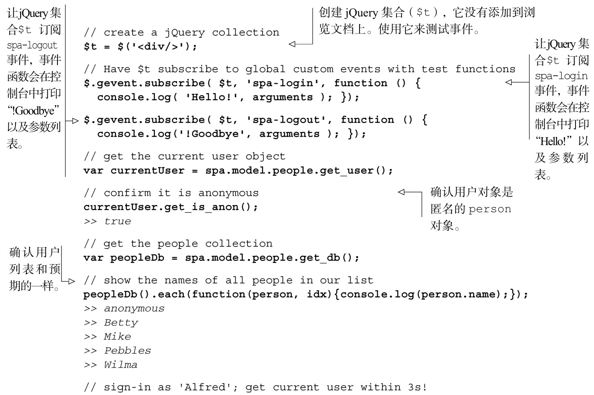
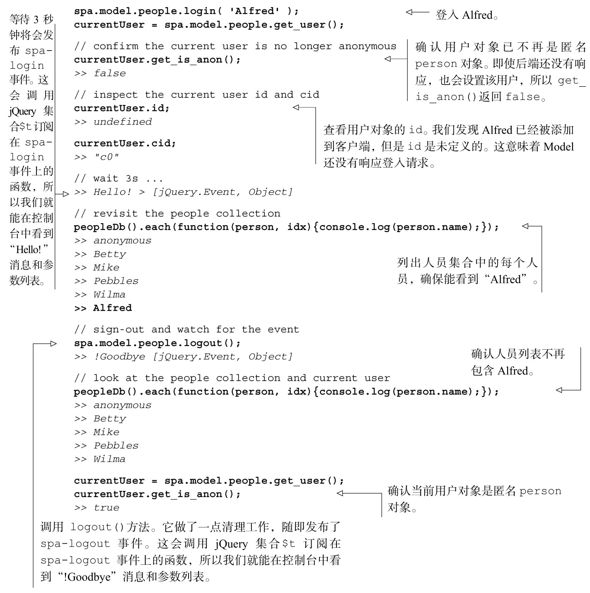

#### 
  5.4.4 测试people对象的API

和计划的一样，隔离Model允许我们测试登入和登出的过程，不用为设置服务器或者准备UI而花费时间和开销。除了节省的开销之外，这也确保了更高的质量，因为测试结果不会受到接口或者数据bug的影响，我们测试的是已知数据集。这种方式，不需要其他研发组完成他们的组件，我们就可以进行工作。

我们来加载浏览文档（spa/spa.html），确保应用和之前一样。然后打开 JavaScript 控制台，测试login、logout和其他方法，如代码清单5-17所示。粗体显示的是输入，斜体显示的是输出。

代码清单5-17 使用JavaScript 控制台测试登入和登出

上面的测试让人放心。表明people对象在完成目标时表现得很不错。我们可以登入和登出，Model的行为和定义的一致。由于Model不需要UI和服务器，很容易创建测试集（test suite）来确保所有的方法符合它们的设计规范。使用有 jQuery 的Node.js就能够运行这个测试集，无需使用浏览器。请查看附录B的综述，如何来完成这一项工作。

此时是休息的好时机。在下一节，我们将更新接口，这样用户就可以登入和登出了。

