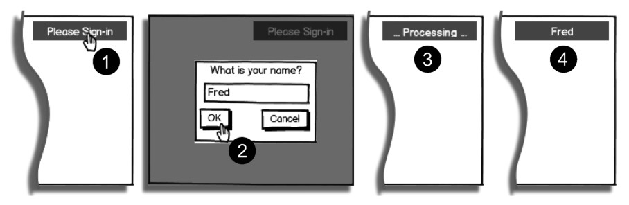

#### 
  5.5.1 设计用户登入的体验

我们喜欢简单和熟悉的用户体验，倾向于用户点击页面右上角来启动登入的过程，这是流行的约定。预想的步骤如图5-12所示。

（1）如果用户未登入，右上角区域（用户区）的提示信息为Please Sign-in。当用户点击这一文字，将会显示登入对话框。

（2）当用户填完对话框表单并点击OK按钮时，就启动了登入过程。

（3）移除登入对话框，当处理登入的时候（这个步骤Fake模块总是要花费3秒钟），用户区显示... processing ...。

（4）一旦登入过程完成，用户区就显示已登入用户的名字。

用户可以点击用户区的文字进行登出。这会把文字恢复为Please Sign-in。

现在已经设计好了用户体验事宜，我们可以更新Shell，让它运转起来。

