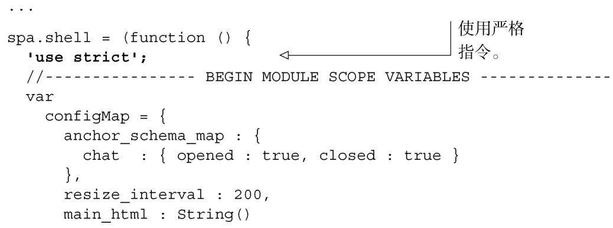
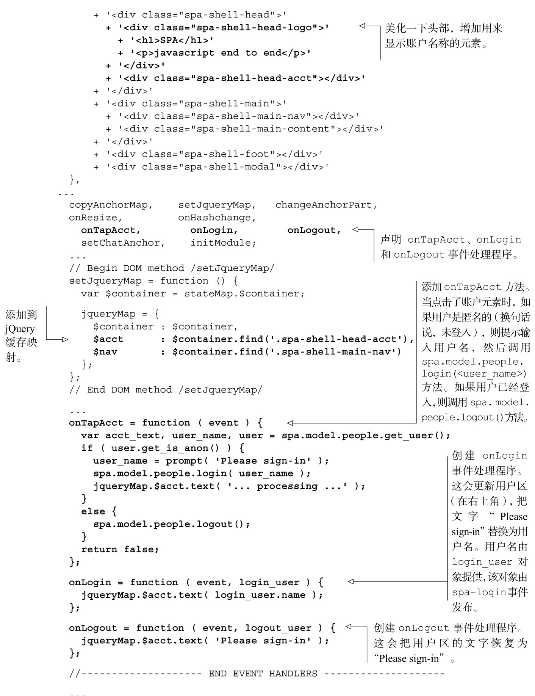
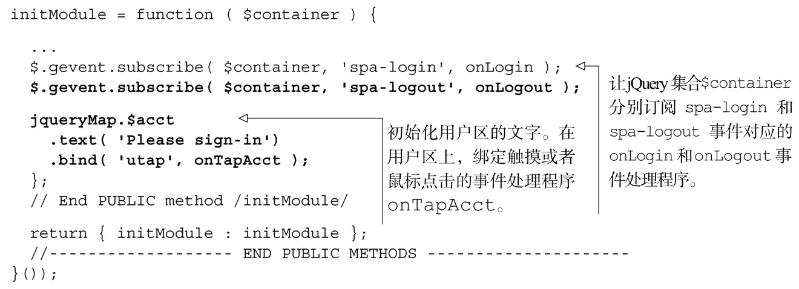

#### 
  5.5.2 更新Shell的JavaScript

由于把数据处理和逻辑放到了Model里面，我们可以让Shell只处理视图和控制器的任务。正如他们说的，当从底层的角度来看，增加对触摸设备（比如平板电脑和移动电话）的支持也是很容易的。我们来修改Shell，如代码清单5-18所示。更改部分以粗体显示。

代码清单5-18 更新Shell，添加登入功能——spa/js/spa.shell.js

一旦熟悉了jQuery全局自定义事件的发布-订阅特性后，我们所做的更改就很好理解了。现在来微调一下CSS，以便正确地显示用户区。

