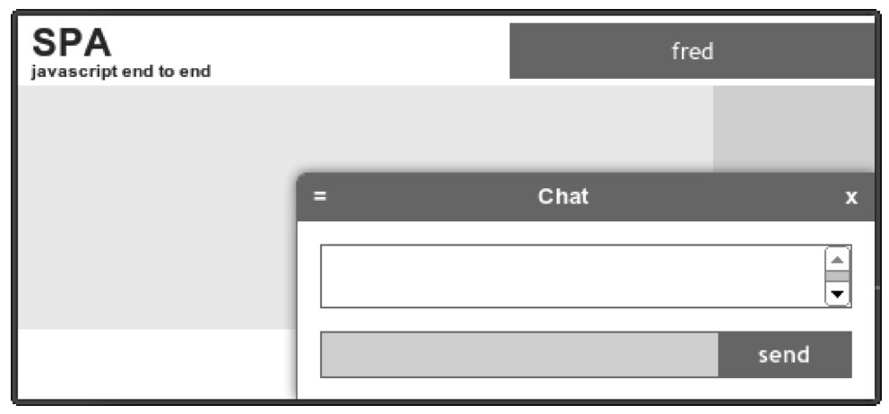

#### 
  5.5.4 使用UI测试登入和登出

当加载浏览文档（spa/spa.html）时，我们看到页面右上角的用户区，显示的是“Please sign in”。当点击这段文字的时候，会显示如图5-13所示的对话框。

当输入用户名并点击OK的时候，对话框会关闭，在用户区会显示“... processing ...”<a class="my_markdown" href="['#anchor21']">[21]</a>，持续3秒钟时间，之后会发布spa-login事件。然后，Shell中订阅了这一事件的处理程序，会更新窗口右上角的用户名，如图5-14所示。

在登入过程中，让用户知道在发生什么事情，从而确保了很好的体验。这是优秀设计的品质证明，始终提供即时反馈，甚至可以使相对较慢的应用，看上去也是又快又具响应性。

