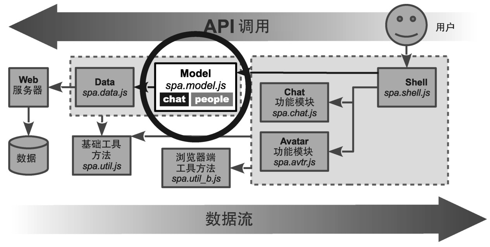
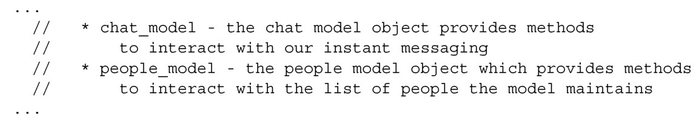

### 
  6.1 设计chat对象

本章我们将构建Model的chat对象，如图6-1所示。

在上一章，我们设计、构建并测试了Model的people对象。在这一章，我们将设计、构建并测试chat对象。我们再看一下在第4章中首次提出的API规范。

chat对象的描述信息（“an object that provides methods to interact with our instant messaging”<a class="my_markdown" href="['#anchor22']">[22]</a>）是很好的切入点，但对实现来说太宽泛了。我们来设计chat对像，首先分析一下想让它完成什么功能。

